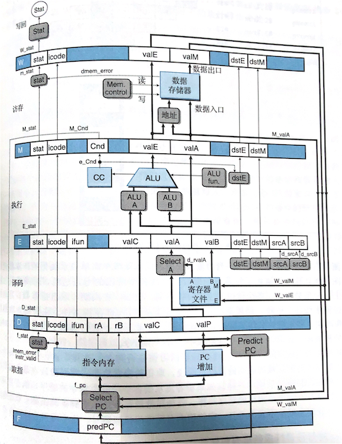

 **深入理解计算机系统** 141-149/728 March 4    
*条件分支与循环*   
1. 汇编中一个简单的跳转和循环：
```asm
  jmp .L2
.L3:
  sarq %rax
.L2:
  testq %rax, %rax
  jg .L3
  ret
```
先无条件跳转到.L2。L2判断%rax是否大于零，是则跳到.L3执行右移和判断（循环），直到不大于零return，结束。
2. C语言跟汇编代码的条件分支的结构关系的一般情况
```
if(xx) then-statment
else else-statement
# 对应的汇编结构：
  if (!xx)
    goto false
  then-statment
  goto done
false:
  else-statment
done:
```
3. 条件操作包括控制的条件转移、数据的条件转移。用一个简单例子说明二者区别：
```
# 控制的条件转移，从CPU角度看可能效率很低
if(c) v=op1
else v=op2

# 数据的条件转移，高效，但可能不可行（比如当op依赖于条件内容时）
v=op1, tmp=op2
if (!c) v=tmp
```

**深入理解计算机系统** 149-164/728 March 5   
*循环和switch*
1. C语言有do-while、while、for循环。而汇编中都是条件测试加跳转实现，主要有两种循环模式。
```
# 第一种模式是jump to middle，先跳转至检测指令行
  goto test
loop:
  body-statement  
test:
  if(t)
    goto loop
```
```
# 第二种模式guarded-do，区别于第一种，条件判断是在body后（条件不满足则结束，否则，后面相当于do-while）
if(!t)
  goto done
loop:
  body-statment
  t = test-expression
  if(t)
    goto loop
done:
```
2. switch语句用于索引多重分支，跟if比其优势是分支判断时间复杂度是O(1)，而if是O(n)。switch用跳转表加索引（开关变量）：
```
# 这个跳转就是根据%rsi中的值查.L4的表进行分支跳转，跳转索引为*(.L4+8*%rsi)，效果是%rsi为0、2跳转到.L3，为1跳到.L2
  jmp *.L4(,%rsi,8)
.L2
  ...
.L3
  ...
# 跳转表的结构
.L4
.quad .L3
.quad .L2
.quad .L3
```
**深入理解计算机系统** 164-175/728 March 6  
*过程*
1. 即函数、方法或子例程，用一组参数和返回类型即可实现某个功能。
2. 以过程P调用过程Q为例，该调用在机器级别的实现需要考虑：
   1. 传递控制：更新PC值为新过程的地址，另外要提前保存旧PC值，返回时还可以恢复PC。
   2. 传递数据：P调用Q时用的参数需要能被Q访问到。 
   3. 分配和释放内存：Q可能要为局部变量分配内存，返回时再释放它们。
3. 运行时栈就是上述设想的实现。P调用Q时，栈可以保存返回地址（控制）和参数（数据），Q返回时，这些空间被释放掉。 
   1. P调用Q，PC种的下一指令的地址被压栈，寄存器状态也被压栈。 
   2. Q的起始地址写入PC，执行Q过程体。
   3. Q执行结束返回时，PC和寄存器恢复为调用前状态。
4. 另外，寄存器最多只能传六个参数，多出六个，则需P将多出的参数压入栈中（在push PC值之前），Q通过Bias(%rsp)方式取参。
5. 被调用者刚被调用时，有责任保存%r12-%r15、%rbp和%rbx状态到栈里，返回时恢复它们。其他都由调用者保存，故被调用者可以随意使用它们。
6. 过程调用会使用寄存器保存变量，有这些情况需要栈保存数据，作为栈帧的一部分：
   1. 寄存器不够用
   2. 对一个局部变量用&取地址
   3. 局部变量是结构或数组
7. 由于栈帧的存在，局部变量是天然隔离的，使递归（包括互相递归）调用成为可能。

**深入理解计算机系统** 175-176/728 March 12  
*递归过程解读（寄存器和栈发挥的核心作用）*

递归计算n!的C代码：
```
long rfact(long n) {
    long result;
    if(n<=1)
        result = 1;
    else
        result = n * rfact(n-1);
    return result;
}
```
用gcc编译出的汇编代码：
```
_rfact:
LFB0:
	cmpq	$1, %rdi       ;先比较%rdi与1，这里可以推断%rdi就是参数n
	jg	L8             ;n>1则跳转到L8
	movl	$1, %eax       ;否则返回1，注意返回值保存在%eax（或说%rax）
	ret                    ;函数返回。栈会弹出之前保存的PC值到PC
L8:
	pushq	%rbx           ;保存现场，即把%rbx的值压栈，下面会用%rbx
LCFI0:
	movq	%rdi, %rbx     ;将n值放到%rbx
	leaq	-1(%rdi), %rdi ;n值减去1
	call	_rfact         ;递归调用_rfact，此时参数%rdi已为n-1。️call命令会将PC值(即下1条指令地址)压栈
	imulq	%rbx, %rax     ;将%rbx（即局部变量n）与%rax（即调用_rfact的返回值）相乘
	popq	%rbx           ;栈弹出一个值放入%rbx。
LCFI1:
	ret                    ;返回乘积%rax
```
值得注意的有两点：
1. 递归调用rfact之前，%rbx旧值先被保存，参数n放到%rbx，%rbi放的是n-1。
2. 调用rfact时，参数还是%rdi，但值已经减一了。所以递归的隔离性就体现出来了：
	每轮递归，%rbx和%rbi保证了局部变量的隔离；
	整个执行过程，二者和栈一起保证局部变量的隔离。

**深入理解计算机系统** 176-178/728 March 13</br>
*数据的内存分配及其数据的访问*
1. C语言的数组很简单，就是**连续存放的、大小相同的**一组数据。指向数组的指针被翻译为地址，索引数据基本思想是地址+偏移量
2. 数组的声明 _**T A[N]**_ 中，T表示数组类型，N是数组大小。如果用a表示数组地址，L表示T的长度，那第i个元素地址就是a+L*i
3. 例如，下面是读取一个int类型数组的操作（比例变址寻址），%rdx就是上式中的a，4是L，%rcx是i。</br>
   ``` movl (%rdx,%rcx,4), %eax```</br>
4. 对数组A[N]而言，上面操作等价于指针运算*(A+i)，但后者没显式给出int大小4，因为本质上数组声明就包含了数据的大小。
5. 单操作数操作符'&'产生指针，'*'间接引用指针（得到指针指向的数据），&A[i]-A的结果是i。
```c
地址跟指针的差异，有点confusing，可以通过一段代码来理解。C语言代码：
long func(int a[]){
	return &a[1] - a;               //结果为1
}
long func2(int a[]){
	return (long)(&a[1]) - (long)a; //结果为4
}
int *func3(int a[]){
        int *b = &a[1];                //结果为a+4
        return b;
}
相应的gcc编译的汇编代码如下，直观地说明了上面三个计算的本质：
_func:
        movl    $1, %eax   ;指针运算，long b = &a[1] - a，指针运算后转long
_func2:
        movl    $4, %eax   ;地址运算，long b = (long)(&a[1])和c是先强制转换为地址，再相减的
_func3:
        leaq    4(%rdi), %rax ;指针的地址运算，直接基址+4取地址
```
7. 二维数组 _**T D[R][C]**_ 第i行j列的元素地址为d+L(C*i + j)：
```
int func(int a[6][8], int i, int j){
	return a[i][j];
}
对应的汇编如下：
  movslq  %esi, %rsi ;
  salq    $5, %rsi   ;C*i，此处在编译优化消除了乘法
  addq    %rsi, %rdi ;再+j
  movslq  %edx, %rdx ;
  movl    (%rdi,%rdx,4), %eax ;再乘以L，之后加上数组基址，内存寻址
```

**深入理解计算机系统** 179-191/728 March 14</br>
*变长数组，结构体和联合体*
1. C语言编译器可以很好地优化定长的数组，前面有所涉及，将乘法转变为移位以寻址。</br>至于变长数组，无法在编译时确定长度，编译会根据访问规律来优化代码，包括降维。
2. 结构体，跟数组的差别是，一组数据可能不是同一类型，不能简单地a+L*i访问第i个元素。</br>不过，思想完全一样，还是a+偏移量。比如：
```
struct rec {
   int i;   //偏移量为0
   int j;   // 4
   int a[2];// 4*2
   int *p; // 8
}
可以用地址(rec+ 4 + 4 + 4i) 来访问rec->a[i]，对应的汇编代码：
movl 8(%rdi,%rsi,4), %rax
因为字段也是顺序存储在内存的，故可以累加偏移量。
```
3. 联合体，跟结构体的区别是：不同字段引用相同的内存块，字段只能互斥地使用，优点是节省空间。</br>
```
union tree_node{
   struct {
      union tree_node *left;
      union tree_node *right;
   } internal;        //内部节点，两个指针
   double data[2]；   //叶子节点存储俩double数值
}
使用union优势就是，internal和data不同时用，共占用16字节内存。而换成结构体占32字节。
这引出一个问题，如何区分是叶子还是内部节点？——需要增加一个flag，用以确定内存实际被谁引用。
```
4. 计算机系统一般对合法地址都有限制，比如通常是2、4或8的倍数，故有数据对齐。
5. 使用结构体，可以通过恰当地安排字段顺序，实现省内存的效果。</br>
比如三个字段类型是char、double、char不如char、char、double省空间。

**深入理解计算机系统** 192-201/728 March 15</br>
*指针，内存越界引用，缓冲区溢出*
1. 关于指针，还有些强调的点：
   1. 每个指针都有其类型，其中void * 类型表示通用指针。类型帮助程序员避免寻址错误。
   2. 指针的类型转换导致指针运算的伸缩，比如：</br>p是char *类型则(int *)p+7表示p+28，而(int *p)(p+7)表示p+7.
   3. 指针可以指向函数，如：
   ```
   int fun(int x, int *p);
   int (*fp)(int, int *); //声明fp是指向函数的指针
   fp = fun;              //函数指针fp指向fun
   fp(3, &a); //最，后通过fp调用fun
   ```
2. C对数组引用不做越界检查，且局部变量、状态都存放在栈中，写入越界的数组元素会破坏栈数据。
3. 常见的破坏是缓冲区溢出（buffer overflow）。下面填充char数组的函数就存在这种情况：
```
int *gets(char *s){
   int c;
   char *dest = s;
   while((c = getchar()) != EOF && c!='EOF')
      *dest++ = c;   //读字符填充s
   *dest++ = '\0';   //以'\0'收尾
   return s;
}
如果我们以buf[8]作为参数，调用上面函数，那么当输入字符个数超过7个时就会越界。
``` 
用一个图表示栈的使用，就很容易理解越界的危险了：

   | 调用者的栈帧 |
   | : --- : |
   |返回地址|
   | |
   |...[3][2][1][0]|
当输入字符足够多时，返回地址可能被覆盖。
5. 当返回地址被改成某段恶意代码的地址，系统就危险了。对抗缓冲区溢出的方法：
   1. 栈随机化，让攻击者不知道栈返回地址。
   2. 栈破坏检测，在上图空白处设置一个值，在恢复寄存器状态和从函数返回前，检查它是否被修改。
   3. 限制可执行代码区域，消除攻击者向系统插入可执行代码的能力。

**深入理解计算机系统** 201-204/728 March 16</br>
*支持变长栈帧*</br>
1. 前面说函数调用会生成栈帧，但是在汇编代码中没有看到生成栈帧，因为前述函数能预先确定需要分配多少空间，</br>故不需要新栈帧，直接压栈局部变量就行。
2. 对于所需局部存储是变长的函数，我们就得创建新的栈帧以调用它了。比如，下面往大小为n的数组填充数据的函数：
```
long vframe(long n, long idx, long *q) {
	long i;
	long *p[n];
	p[0] = &i;
	for (i=1; i<n; i++)
		p[i] = q;
	return *p[idx];
}
_vframe:
	pushq	%rbp              ;第一：进入函数，先保存帧指针
	movq	%rsp, %rbp        ;第二：帧指针指向上个栈帧的顶，这意味着新栈帧的创建。下面都是准备数据以及压栈操作……
	subq	$16, %rsp         ;分配16字节，根据下面推断，分给了变量i
	leaq	15(,%rdi,8), %rax
	andq	$-16, %rax
	subq	%rax, %rsp        ;为数组p分配空间
	leaq	7(%rsp), %rcx     ;p[0]地址
	movq	%rcx, %rax
	shrq	$3, %rax          ;地址 逻辑右移3
	andq	$-8, %rcx         ;取索引值
	leaq	-8(%rbp), %r8
	movq	%r8, 0(,%rax,8)   ;给p[0]赋值
	movq	$1, -8(%rbp)      ;给i赋值
	jmp	L2
L3:
	movq	%rdx, (%rcx,%rax,8)  ;给p[i]赋值为q
	addq	$1, -8(%rbp)      ; i++
L2:
	movq	-8(%rbp), %rax
	cmpq	%rdi, %rax
	jl	L3                ;判断i < n，则跳转到L3继续循环
	movq	(%rcx,%rsi,8), %rax
	movq	(%rax), %rax
	leave                     ;第三：恢复帧、栈指针%rbp和%rsp
	ret
```
**深入理解计算机系统** 204-216/728 March 18</br>
*浮点代码*</br>
1. 本节介绍的都是浮点数相关的存储、访问、传参、操作等问题。</br>浮点数有专门的寄存器，这基于图像、图形处理的媒体指令体系的发展而来，其本意是并行处理多个数据（SIMD）。
2. 浮点数用的寄存器是16个YMM（256位）或XMM（YMM的低128位），类似于整数操作，浮点数操作也有其一整套指令集。
   1. 浮点数传送6条，包括内存->XMM、XMM->内存以及XMM之间传数据，它们每个都有对应的单精度、双精度指令。</br>例如：指令vmovss M, X用来将内存数据复制到XMM。
   2. 浮点数类型转换8条，包括单/双精度<-->整数/四字整数，每种都有对应的X/M -> R以及M/R -> X指令。</br>例如：指令vcvtsi2ss M, X用来将内存的整数转换为单精度数到XMM。
   3. 浮点运算14条，包括加、减、乘、除、两数最大值、两数最小值、平方根，单精度和双精度都有对应指令。</br>例如：vaddss S1, S2, D用来做加法。这些指令第一个源操作数可以是M或X，第二个源操作数及目的操作数须是X。
   4. 位级操作4条，包括异或、与，单精度、双精度都有对应的指令。</br>例如：vandps S1, S2, D用来做位级与。这些操作数都仅可以在X上。
   5. 浮点数比较2条，分别是单精度和双精度比较。</br>例如：vucomisd S1, S2比较双精度值。类似于整数比较，它们也用CF、ZF、PF（奇偶标志）表示比较结果。
3. 浮点数作为过程参数，跟整参比，有特殊规则：
   1. 寄存器%xmm0~%xmm7最多传8个浮点参数，额外的需要利用栈传输。
   2. 函数返回浮点值放在%xmm0，而非%rax。
   3. 所有的XMM寄存器都由调用者保存，被调用者可以随便使用。
4. 编译器开发者、GCC致力于并行运算能力的提高。处理混合类型数据时，有很多复杂的优化规则。

**深入理解计算机系统** 243-250/728 March 19</br>
*Y86-64指令集结构（第三章）*</br>
1. 受x86-64的启发，作者想出名为Y86-64的指令集体系结构，用以理解计算机系统是如何工作的。  
Y86-64更加简单，指令数、操作数类型和寻址方式都较少，字节级编码相对简单。下面是程序员可见的状态：
   1. 程序寄存器有15个，%rax, %rcx, %rdx, %rbx, %rsp, %rbp, %rsi, %rdi和%r8~%r14，分别用十六进制数字0-E表示，  
   F表示不用寄存器。%rsp仍是栈指针，用于压栈、出栈和过程的返回。
   2. 条件码有ZF、SF、OF。
   3. 程序计数器PC。
   4. 内存DMEM，指令用虚拟地址引用内存位置。
   5. 程序状态Stat，表示程序运行是正常还是异常的。
2. Y86-64的指令，数据都是8字节的，所以指令可以很简化，下图是指令的机器级表示：
      <table>
         <tr>
            <th>字节</th> <td colspan="2">0</td> <td colspan="2">1</td> <td>2</td>
            <td>3</td> <td>4</td> <td>5</td> <td>6</td> <td>7</td> <td>8</td> <td>9</td>
         </tr>
         <tr>
            <td>halt</td>
            <td>0</td> <td>0</td>
         </tr>
         <tr>
            <td>nop</td>
         <td>1</td> <td>0</td>
         </tr>
         <tr>
            <td>rrmovq rA, rB</td>
            <td>2</td> <td>0</td>
            <td>rA</td>
            <td>rB</td>
         </tr>
         <tr>
            <td>irmovq V, rB</td>
            <td>3</td> <td>0</td>
            <td>F</td> <td>rB</td>
            <td colspan="8" align="center">V</td>     
         </tr>
         <tr>
            <td>rmmovq rA, D(rB)</td>
            <td>4</td> <td>0</td>
            <td>rA</td> <td>rB</td>
            <td colspan="8" align="center">D</td>
         </tr>
         <tr>
            <td>mrmovq D(rB), rA</td>
            <td>5</td> <td>0</td>
            <td>rA</td> <td>rB</td>
            <td colspan="8" align="center">D</td>
         </tr>
         <tr>
            <td>Opq rA, rB</td>
            <td>6</td> <td>fn</td>
            <td>rA</td> <td>rB</td>
         </tr>
         <tr>
            <td>jXX Dest</td>
            <td>7</td> <td>fn</td>
            <td colspan="9" align="center">Dest</td>
         </tr>
         <tr>
            <td>cmovXX rA, rB</td>
            <td>2</td> <td>fn</td>
            <td>rA</td> <td>rB</td>
         </tr>
         <tr>
            <td>call Dest</td>
            <td>8</td> <td>0</td>
            <td colspan="9" align="center">Dest</td>
         </tr>
         <tr>
            <td>ret</td>
            <td>9</td> <td>0</td>
         </tr>
         <tr>
            <td>push rA</td>
            <td>A</td> <td>0</td>
            <td>rA</td> <td>F</td>
         </tr>
         <tr>
            <td>push rA</td>
            <td>B</td> <td>0</td>
            <td>rA</td> <td>F</td>
         </tr>
      </table>
   
      _上图中fn表示0～F间某整数，rA和rB是寄存器，F表示不用寄存器，V、D和Dest分别是8字节数或地址。_
3. Y86-64指令集有几个特点：
      1. 所有指令，第一个字节的高四位表示代码，低四位表示功能。最短指令只有1字节，如halt、nop、ret；最长10字节。
      2. XX**movq**指令有4个，分别对应M、R、I间数据的拷贝，不支持寄存器伸缩，只支持偏移。
      3. 整数操作指令Opq有4个，分别是addq、subq、andq、xorq，只操作寄存器，它们会设置条件码。
      4. 跳转指令**j**xx有7个，jmp、jle、jl、je、jne、jge、jg。
      5. 条件传送指令6个，当fn=0时，它就是rrmovq指令，用于无条件传送。
      6. 跳转和过程调用都直接使用地址，而非相对偏移量，这样描述起来更简单。
4. 关于汇编指令和机器指令的转换，举个例子，rmmovq %rsp, 0x123456789abcd(%rdx)翻译成机器码就是：  
   **40**42**cdab896745230100**  
   **操作** 俩寄存器 **偏移量**（小端机器）
5. 指令为什么这么设计？主要考虑几点：
   1. 唯一性：让每个指令都有不同前缀（第一个字节）。
   2. 效率：指令能短则短，寄存器只占4字节，栈操作可以省略一个栈指针参数……

**深入理解计算机系统** 250-256/728 March 20</br>
_Y86-64程序和异常_
1. 程序执行的状态Stat有四种：  

   | 值 | 名字 | 含义 
   | :---: | :---: | --- | 
   | 1|AOK |正常操作 |
   | 2|HLT|遇到执行halt指令 
   | 3| ADR| 非法地址
   | 4| INS| 非法指令
&emsp;遇到异常时，一般处理器会调用异常处理程序，Y86-64为了简化，直接停止执行指令。
2. 对于一个简单的加法运算，Y86-64与X86-64代码的不同点有：
   - 将常数加载到寄存器才能做算数运算，因为算术指令Opq不支持立即数。
     <table><tr>
     <td>Opq rA, rB</td>
     <td>6</td> <td>fn</td>
     <th>rA</th> <th>rB</th>
     </tr></table>
   - 要从内存读取一个数与寄存器相加，需要两条指令，原因是算术运算不支持内存寻址，须先将内存数据加载到寄存器。
3. 作者用自己实现的指令集模拟器（YIS）来模拟Y86-64机器代码的执行，可以模拟执行指令，跟踪寄存器、内存状态。
4. pushq指令，它用于将栈指针减8，并将一个寄存器值写入内存。
可是，如果我们执行pushq %rsp指令，处理器怎么办呢？  
   要么压入%rsp的原始值，要么压入减8后的%rsp，Y86-64选择了前者。

**深入理解计算机系统** 256-259/728 March 21</br>
_逻辑设计和硬件控制语言HCL_
1. 数字电路技术中，一般用高电位表示逻辑1，低点位表示逻辑0。一个数字系统有三个主要组成：
   1. 计算对位进行操作的函数的组合逻辑。
   2. 存储位的存储器单元。
   3. 控制存储单元更新的时钟信号。
2. 硬件控制语言（HCL）可以用来处理器设计的控制逻辑。
3. 软件有编程语言，硬件电路设计也有它的语言，称为硬件描述语言（HDL），如最常用的Verilog。</br>HDL看上去跟编程语言很像，但描述的是硬件结构，而非程序行为。
4. 数字电路的基本单元是逻辑门，包括AND、OR、NOT，它们分别用符号&&、||、!表示，每个输入和输出都对应一个bit。
5. 多个逻辑门可组成组合电路。组合电路中，不同逻辑门可以共输入，但不能共输出，否则会出现信号矛盾；  
且不能成环，否则会使函数出现歧义。
6. 以下面HCL布尔语句为例，说明一下组合电路：
   1. a和b是输入信号，二者经过AND门输出s1。
   2. 且二者分别经过NOT门作为下一个AND门的输入，输出s2。
   3. s1和s2经过OR输出的信号表示a、b是否相等。
```
bool eq = (a && b) || (!a && !b)
```
7. HCL在形式上近似于C语言，但是二者有根本性不同：
   1. 组合电路的输出会持续跟随输入变化，而C语言的"="语句只在运行到时才导致值变化。
   2. 逻辑门只对0、1进行操作，而C语言的逻辑表达式可对任意整数操作。
   3. C语言中，逻辑表达式可能只部分求值，如`expr_false() && expr_true()`，expr_true()不会执行。</br>
   而在逻辑电路中，这些表达式都是客观存在的逻辑门，每部分都会响应输入产生输出。
   
8. 可以把逻辑门组合成大的网，或者说将位组合成字，设计出能对数据字操作的电路。</br>
   比如：使用64个eq，8字节的A从低到高每一位分别作为64个eq的第一个输入，</br>同样8字节B的每一位作为8个eq的第二个输入，8个输出经AND门即可得到A是否等于B。
9. 判断俩8字节数是否相等的电路，功能如此简单，但消耗的逻辑门有321个之多！可以想见，大规模数字电路设计是多么宏伟的工程。

**深入理解计算机系统** 259-264/728 March 22</br>
_硬件控制语言HCL、存储器和时钟_
1. 多路复用器MUX，即信号s从输入中选择一个作为输出，在HCL中用情况表达式描述，通用表达式：
```
n路复用器MUXn，硬件上不同select必须互斥
[
   select1 : expre1
   select2 : expre2
   ...
   selectn : expren
]
例如，两个控制信号s0和s1可以产生四种输出，分别选择A、B、C、D作为输出
word Out = [
!s1 && !s0  : A; # 00
!s1         : B; # 01
!s0         : C; # 10
1           : D; # 00 当前面条件都不符合时，此条件必符合，故简化为1
]
```
2. 算术/逻辑单元ALU在Y86-64中可以执行4种整数操作（加减、与、异或），控制使用哪个操作，本质也是多路复用。<br>电路控制值s和功能码（前面提到的机器码）是对应的。
3. 集合关系，将一个信号与许多可能匹配的信号做比较，以检测正在处理指令的代码是否属于某一类指令代码。<br>
例如，用两位的信号code控制对4个数据的选择，还是使用MUX4，只是s0和s1变成了：
```
用集合表达式：
bool s1 = code in {2, 3}
bool s2 = code in {1, 3}
```
4. 组合电路不存储信息，只响应输入并产生输出。为了产生**时序电路**，即包含了状态，就得引入按位存储的存储器。<br>
存储器使用同一个时钟（产生周期性信号）控制，决定什么时候把新值加载进去。
   1. 时钟寄存器（寄存器），存储单个位或字，时钟信号控制寄存器加载输入值。
   2. 随机访问寄存器（内存），存储多个字，用地址决定存哪个字。包括寄存器文件和虚拟内存。
5. 时钟信号由低变高时，输出从寄存器写出去，输入同理。此处寄存器相当于一个屏障，等待时钟**上升沿**才打开。
6. 寄存器文件有两个**读端口**，一个**写端口**，和一个时钟信号，可以同时读写多个寄存器。<br>其中每个读/写端口都有两种信号：寄存器地址、数据。
7. 内存有四个输入：数据、地址、**读、写**、时钟，两个输出：数据、error。

**深入理解计算机系统** 264-267/728 March 23</br>
_Y86-64的顺序实现_
1. 先实现一个顺序执行指令的处理器SEQ，最终目的是实现高效流水线化的处理器。
2. 首先将一条指令的执行分为以下阶段，对应不同时间硬件的动作：
   1. **取指**：从内存中读取指令字节，内存地址是PC中的值。第一个字节是icode:ifun。<br>
   第二个字节（如果有）指明了两个寄存器rA:rB<br>
   后续可能取出8字节的常数valC。<br>
   计算出下一条指令地址valP=(PC+已取出的指令长度)。
   2. **译码**：从寄存器文件读数，读到rA、rB指明的寄存器，或者%rsp。
   3. **执行**：ALU根据ifun的值要么计算内存引用的有效地址，要么加减栈指针，得到结果valE，设置条件码。
   4. **访存**：读/写内存，读出的值为valM。
   5. **写回**：最多可以将俩结果写到寄存器文件。
   6. **更新PC**：前面已计算出下个指令地址，写入PC即可。
3. 处理器无限循环执行上述步骤，当然不是每一条指令在每个阶段都有动作。
4. 我们面临的挑战是把我们的指令放到上述框架，这里先列出简单的整数操作指令：

   | 阶段 |Opq rA,rB |
   | :--- | :--- | 
   |取指|icode:ifun <- M<sub>1</sub>[PC]<br>rA:rB <- M<sub>1</sub>[PC+1]<br>valP <- PC+2 |
   |译码|valA <- R[rA]<br>valB <- R[rB]||
   |执行|valE <- valB OP valA<br> Set CC|
   |访存||
   |写回|R[rB] <- valE|
   |更新PC|PC <- valP|
   下面是计算21-9的机器码，前两行是将21和9加载到寄存器%rdx和%rbx。
   ```
   0x000: 30f2090000000000
   0x00a: 30f3015000000000
   0x014: 6123
   ```
   我们重点看下第三条subq %rdx, %rbx的处理过程：
   
   | 阶段 |subq %rdx, %rbx|注
   | :--- | :--- | :---|
   |取指|icode:ifun <- M<sub>1</sub>[0x014]=6:1<br>rA:rB <- M<sub>1</sub>[0x015]=2:3<br>valP <- 0x14+2=0x16|第一个字节表示subq<br>第二个字节指明用哪俩寄存器<br>下一个PC是当前地址加2
   |译码|valA <- R[%rdx]=9<br>valB <- R[r%rbx]=21|将俩数放到指定的俩寄存器|
   |执行|valE <- 21 - 9 =12<br> ZF <- 0, SF <- 0, OF <- 0|执行减法得到结果，设置状态
   |访存| |不涉及内存读写|
   |写回|R[%rbx] <- valE = 12|将结果写回%rbx
   |更新PC|PC <- valP = 0x016|更新PC

**深入理解计算机系统** 267-269/728 March 25</br>
_Y86-64的顺序实现，继续啃执行指令的阶段_
1. 通过前面对指令执行阶段的分析，发现一些规律：</br>处理器先取指令第一个字节，它决定了后续字节是什么及其大小（俩寄存器占1字节、整数占8字节）和ALU行为。<br>
执行是第3阶段，一次只能执行整数运算，这限制了所有的指令运算上的复杂度。<br>有些指令看起来是先访存再执行计算，但实际是相反的，这也是指令这个通用模式。
2. 下面是两种数据传送指令rmmovq和mrmovq的执行阶段：

   | 阶段 |rmmovq rA, D(rB)| mrmovq D(rB), rA
   | :--- | :--- | :---|
   |取指|icode:ifun <- M<sub>1</sub>[PC]<br>rA:rB <- M<sub>1</sub>[PC+1]<br> valC<-M<sub>8</sub>[PC+2]<br> valP <- PC + 10|icode:ifun <- M<sub>1</sub>[PC]<br>rA:rB <- M<sub>1</sub>[PC+1]<br>valC<-M<sub>8</sub>[PC+2]<br>valP <- PC + 10
   |译码|<b>valA <- R[rA]</b><br>valB <- R[rB]|valB <- R[rB]|
   |执行|valE <- valB + valC|valE <- valB + valC
   |访存| M<sub>8</sub>[valE] <- valA|valM <- M<sub>8</sub>[valE]|
   |写回| |<b>R[rA] <- valM|
   |更新PC|PC <- valP|PC <- valP
3. 再看下push和pop指令，看似简单实际麻烦，不光计算栈指针，还要访存：
   
   | 阶段 |pushq rA| popq rA
   | :--- | :--- | :---|
   |取指|icode:ifun <- M<sub>1</sub>[PC]<br>rA:rB <- M<sub>1</sub>[PC+1]<br> valP <- PC + 2|icode:ifun <- M<sub>1</sub>[PC]<br>rA:rB <- M<sub>1</sub>[PC+1]<br>valP <- PC + 2
   |译码|valA <- R[rA]<br> valB <- R[%rsp]|valA <- R[%rsp]<br> <b>valB <- R[%rsp]|
   |执行|valE <- valB + (-8))|valE <- valB + 8
   |访存| <b>M<sub>8</sub>[valE]</b> <- valA | valM <- <b>M<sub>8</sub>[valA]|
   |写回|R[%rsp] <- valE |R[%rsp] <- valE<br><b> R[rA] <- valM|
   |更新PC|PC <- valP|PC <- valP

**深入理解计算机系统** 269-271/728 March 26</br>
_指令执行的阶段，包括 jXX，call，ret_

| 阶段 |jXX Dest| call Dest | ret |
| :--- | :--- | :---| :---
|取指|icode:ifun <- M<sub>1</sub>[PC]<br> valC<-M<sub>8</sub>[PC+1]<br> valP<-PC + 9 | icode:ifun <- M<sub>1</sub>[PC]<br> valC<-M<sub>8</sub>[PC+1]<br>valP <- PC + 9 | icode:ifun <- M<sub>1</sub>[PC]<br> valP <- PC + 1
|译码| | valB <- R[%rsp]| valA=R[%rsp]<br> valB=R[%rsp]|
|执行|Cnd<-cond(CC,ifun)|valE <- valB + -8 | valE <- valB + 8
|访存| |<b> M<sub>8</sub>[valE] <- valP| **valM <- M<sub>8</sub>[valA]** 
|写回| |R[%rsp] <- valE| R[%rsp]<-valE|
|更新PC|<b>PC <- Cnd?valC:valP | <b>PC <- valC | <b>PC <- valM

1. jXX需判断条件，该过程也由ALU完成，输出信号控制PC取哪个值。所以，最后PC更新啥值取决于Cnd。
2. call隐含使用%rsp，用来支持将下一指令地址压栈，最后PC更新成Dest地址valC。  
可以看出PC值的更新只用到第一、六阶段，二、三、四、五都服务于压栈。
3. ret这个单字节指令也用到了所有阶段，相当于call的逆过程：PC会变成栈顶存的值，出栈需要阶段二、三、四、五。
4. 还有一个值得注意的点，访存用的都是valX（这由硬件电路限制）所以译码时%rsp被两个端口读取。
5. 到这里，所有指令的执行阶段都啃完了，发现确实指令都能使用这一套框架。  
指令的执行始于PC -> 拿到指令、数据 -> 确定使用哪些寄存器 -> 执行指令 -> 访存 -> 更新寄存器 -> 终于更新PC。  
六个阶段形成闭环，CPU轮回的宿命就此确定。

**深入理解计算机系统** 271-274/728 March 27</br>
_Y86-64的SEQ硬件结构_

1. 图示很清楚，六个阶段从左下角开始顺时针进行。
   1. 白框表示时钟寄存器，白圈是线路名，蓝色是硬件单元，灰色框是控制逻辑块。
   2. 虚线表示位1位的数据，细线表示4或8位的数据，粗线表示64位数据。
2. 所有硬件单元的处理都在一个时钟周期完成。
3. 有了这个图，就能更清楚地理解指令为什么要那样分六个阶段了。
   1. PC取出来的icode:ifun，决定ALU动作，rA和rB决定用到的寄存器，valC也根据指令类型作为立即数/地址。
   2. ALU计算结果的类型有单个位和字，前者控制着条件跳转和条件传送；后者是地址/数据，用于存储模块的访问，  
   包括寄存器和内存，这就是写回、访存在第四、五阶段的原因。
   3. 更新PC所用地址可以是valP、valC、valM，控制信号有icode和Cnd。
   4. 之前分析译码时，觉得valA和valB可以互换，但该图限制了valB只能作为ALU的输入，valA除此还可以作为内存的输入。

**深入理解计算机系统** 274-277/728 March 28</br>
_Y86-64的SEQ时序_
1. 前面说指令分阶段执行，实际上完全不是时间顺序。因为组合电路有输入就会立即有输出，  
所以组合电路状态变化时，它所连端口电位都会同时变化。
2. 故我们不考虑组合电路对时序的影响，只考虑存储器设备——时钟寄存器、随机访问存储器的影响，明确一下：
   1. 程序计数器、条件码寄存器属于时钟寄存器。
   2. 数据内存、寄存器文件属于随机访问存储器。
   3. 同属RAM的还有指令存储器，但它只用来读指令，故考虑成组合逻辑。<br>
   因为，时序控制仅发生在写存储设备时刻。
3. 我们结合实际的指令，考虑硬件工作逻辑，重点是组合逻辑跟存储器设备的区别。如下图所示：
   1. 周期3开始时，除了PC，所有的电路还处于前一条指令结束的状态没来得及更新。
   2. 周期3中，addq让组合逻辑立即更新其相连的线路状态，蓝色就是更新了的部分。
   3. 周期4开始，**时钟上升沿来来，存储器被更新**（蓝色），更新成addq对应的状态和结果。
   4. 周期4结束，je也被组合逻辑电路执行了（灰色），但是存储设备仍需等时钟上升沿到来才能更新。


3. 处理器在一个时钟周期内执行完一条指令，其**重要原则是，绝不为了完成一条指令而读由该指令更新了的状态**。  
   来个例子：push指令执行时，从软件角度考虑，先将%rsp减8 -> 再用更新后%rsp作为访存的地址。<br>  
   显然这么考虑跟该原则相悖。实际上，硬件通过ALU计算出减8后的值valE后，**同时**输出到%rsp（值）和内存（址）。
4. 在这个原则下，所有条件码相关的指令中，没有一条指令既更新状态又读这个状态的。

**深入理解计算机系统** 277-282/728 March 29</br>
_SEQ阶段的实现_
1. 前面说指令执行的六个阶段不是按时间划分的，而是按空间或硬件模块，下面就看看不同阶段的硬件实现。

   <table style="border-color: transparent">
   
      <tr>
         <td>  </td>
         <td> </td>
      </tr>
      <tr>
         <td>  </td>
         <td> </td>
      </tr>
      <tr>
         <td colspan="2"></td>
      </tr>
   
   </table>
   
2. 下面HCL用大写单词表示指令的代码、功能码、寄存器ID、硬件信号名、ALU操作和状态码的常数值。  
   
  ```
1. 取指：灰色的组合电路会以icode和ifun作为输入，并输出响应，如
bool need_regids = icode in {
   IRMOVQ, IOPQ, IPUSHQ, IPOPQ, IIRMOVQ, IRMMOVQ, IMRMOVQ
  }
  
2. 译码和写回：这俩阶段都是寄存器的读写，故放在一起了，寄存器文件访问的地址也受icode控制，如读寄存器地址的计算：
word srcA = [
    icode in {IRRMOVQ, IRMMOVQ, IOPQ, IPUSH } : rA;
    icode in {IPOP, IRET } : RRSP;
    1 : RNONE;
  ] 
3. 执行阶段：ALU根据ALU fun信号决定计算类型，选择valA还是valC输入，仍然由icode控制。

4. 访存阶段：类似于译码、写回，内存地址受icode控制，可选valA或者valE：
word mem_addr = [
    icode in { IRMOVQ, IPUSH, ICALL, IMRMOVQ } : valE;
    icode in { IPOPQ, IRET } : valA;
  ]
  
5. 更新PC阶段：PC可以取值
word new_pc = [
    icode = ICALL : valC;
    icode = IJXX && Cnd : valC;
    icode = IRET : valM;
    1 : valP;
  ]
```
3. 很多复杂逻辑并没在上面写出来，只写了最简单的控制信号对输入选择的决定过程。  
可以看出icode参与了所有控制，再次强调所有控制都是同时发生的。  
ps：按时间分阶段的话，第一阶段是组合电路的响应，第二阶段是存储设备的写入。  
   阶段间只有上升沿瞬间的间隔，两阶段内所有动作都同时进行——所以硬件电路要考虑所有信号的生成和布线，这就是硬件电路复杂性的来源。 


**深入理解计算机系统** 282-287/728 March 30</br>
_SEQ流水线化_

1. 通过前面的分析，发现组合逻辑跟存储的写入是串行的，共占用一个时钟周期T，想完成所有阶段，T必须足够大。
2. 显然，这种串行执行的方式太慢，事实上，不同阶段只占用T的一部分，所以我们可以做流水线优化。
3. 假设我们用A、B、C分别表示组合逻辑A、寄存器和组合逻辑B的执行动作，下图就表示了不同时间的动作。

   <table>
      <tr>
         <td>I1</td>
         <th>A</th>
         <th>B</th>
         <th>C</th>
      </tr>
      <tr>
         <td>I2</td>
         <th></th>
         <th>A</th>
         <th>B</th>
         <th>C</th>
      </tr>
      <tr>
         <td>I3</td>
         <th></th>
         <th></th>
         <th>A</th>
         <th>B</th>
         <th>C</th>
      </tr>
   </table>

4. 流水线操作的基础仍是前面分析的时钟寄存器，每个指令在时钟上升沿到来时就进入下一阶段。
5. 这样一来，每个时刻A、B、C都在执行，提升了吞吐量。相应地，代价是延时增加、硬件增加。
6. **时钟周期T缩短为A、B、C中最耗时的消耗的时间T'**。T'可以增大，但不能缩小.<br>否则，可能因组合逻辑来不及反应而产生混乱。
7. 要充分利用流水线，必须将每个阶段划分得更小、执行时间更短，这样才能提高时钟频率，让速度更快。

**深入理解计算机系统** 284-288/728 March 31</br>
_流水线延迟、吞吐量和反馈_
1. 昨天理解的阶段划分有问题，我原以为A、B、C中B是寄存器，其他是组合逻辑。  
   **正确的理解是A、B、C每个都包含组合逻辑和寄存器**。  
其实，在说流水线之前，我们已经分析过，指令执行在时间上可以分为两阶段，组合逻辑+时钟寄存器。  
寄存器保存组合逻辑执行的状态，为了提高吞吐量我们将组合逻辑拆分成3个，那每个后面都需要加寄存器保存状态。

   <table>
      <tr>
         <td>I1</td>
         <th>A</th>
         <th>B</th>
         <th>C</th>
      </tr>
      <tr>
         <td colspan="2">I2</td>
         <th>A</th>
         <th>B</th>
         <th>C</th>
      </tr>
      <tr>
         <td colspan="3">I3</td>
         <th>A</th>
         <th>B</th>
         <th>C</th>
      </tr>
   </table>
    A(组合逻辑+寄存器) -> B(组合逻辑+寄存器) -> C(组合逻辑—+寄存器)
2. 以洗车为例分析指令流水线化。洗车包括冲水、擦洗、上蜡、烘干等步骤。  
如果我们把它当作不可分割的阶段，那每时刻只能有一个步骤在进行，其他车在排队。  
如果把步骤当作阶段，每时刻就有四个步骤同时进行，同时服务四辆车。
3. **吞吐量**是指单位时间执行的指令数。**延迟**是指从头到尾执行一条指令所需时间。
4. 现在我们分析一下流水线化带来的吞吐量和延迟的变化，假设寄存器需20ps，组合逻辑需要300ps：  
   1. 指令在线性执行时：  
   延迟 = 300 + 20 = 320(ps)  
   吞吐量 = 1个指令/(300ps + 20ps) * 1000ps/ns = 3.12 GIPS   

   2. 指令分3级流水线化执行，设A、B、C中每个的组合逻辑都需要100ps，那么  
   延迟 = 3 * (100 + 20) = 360 (ps)  
   吞吐量 = 1/(120 * 3) * 1000ps/ns = 8.33 GIPS  
对比发现，流水线化让吞吐量增大，延迟增加。另外，吞吐量是有上限的，因为  
      吞吐量通式：**1/(t1 + t2/k)**  
   其中，k是流水线深度，t1是寄存器时间，t2是组合逻辑时间。当k -> ∞时，得到吞吐量上限1/t1。
5. 上面流水线化确实提高了吞吐量，但问题是，它不适用于很多场景。例如下面指令：  
irmovq $50, **%rax**  
addq **%rax**, %rbx
两条是相关联的，第二条指令的执行依赖第一条的结果，上面流水线无法满足该需求。  
再如：
subq %rdx, %rbx  
**jne** target  
jne需要知道前一条指令的执行结果才可以跳转。

**深入理解计算机系统** 288-295/728 Apr 2</br>
_Y86-64流水线的实现，重新安排计算阶段和预测PC_
1. 前面说，指令的执行有时是上下文相关的，这就需在流水线加入反馈，反馈的存在阻碍了流水线的实现。  
Y86-64流水线的实现：在SEQ处理器的基础上，将PC的计算挪到取指阶段。然后，在各阶段加上流水线寄存器。  


2. 通过上图可以看出，PC的从之前的时钟结束时移动到了时钟开始时。
3. 更大的变化是在每个阶段加了流水线寄存器：
   1. F用来保存PC的预测值。
   2. D位于取指和译码之间，保存取的指令信息，会被译码阶段使用。
   3. E位于译码和执行之间，保存关于译码指令和从寄存器文件读出的数据。
   4. M位于执行和访存之间，保存最新执行指令的结果，还保存关于分支条件/目标的信息。
   5. W位于访存和反馈路径之间，计算值valE经反馈路径提供给寄存器文件写。ret时给PC提供返回地址。
4. 下图是指令（不相关）经过上面流水线处理的各阶段关系，当I1到周期5时，I5刚到周期1。  
上图从下向上的控制、数据流，跟下图的阶段是一致的。
   <table>
      <tr>
         <td>I1</td>
         <td>F</td>
         <td>D</td>
         <td>E</td>
         <td>M</td>
         <th>W</th>
      </tr>
      <tr>
         <td colspan="2">I2</td>
         <td>F</td>
         <td>D</td>
         <td>E</td>
         <th>M</th>
         <td>W</td>
      </tr>
      <tr>
         <td colspan="3">I3</td>
         <td>F</td>
         <td>D</td>
         <th>E</th>
         <td>M</td>
         <td>W</td>
      </tr>
      <tr>
         <td colspan="4">I4</td>
         <td>F</td>
         <th>D</th>
         <td>E</td>
         <td>M</td>
         <td>W</td>
      </tr>
   
      <tr>
         <td colspan="5">I5</td>
         <th>F</th>
         <td>D</td>
         <td>E</td>
         <td>M</td>
         <td>W</td>
      </tr>
   </table>
5. 流水线的目的是每个时钟周期都能获取新的指令，因为指令的复杂性，新指令的地址并不总是确定的。  
比如一个条件控制会导致后一个指令过了执行阶段后，当前指令才能获知下个指令地址；  
如果取出的指令是ret，那访存阶段才能确定返回地址。
6. 尽管如此，PC值也只有少数几种可能——valC、valP。这为预测PC提供了条件，Y86-64简单地总预测PC为valC。

**深入理解计算机系统** 295-304/728 Apr 6</br>
_Y86-64流水线的实现，流水线冒险和解决_
1. 当相邻指令存在相关时，流水线可能存在冒险问题——数据冒险和控制冒险。
2. 数据冒险是指一条指令前面指令生成的数据，但是数据还没准备好，以下面指令为例说明数据冒险：  
```
0x000:   irmovq $10, %rdx
0x00a:   irmovq $3, %rax
0x014:   nop
0x015:   nop
0x016:   nop
0x017:   addq %rdx, %rax
0x019:   halt
```

<table>
      <tr>
         <td> irmovq $10, %rdx</td>
         <td>F</td>
         <td>D</td>
         <td>E</td>
         <td>M</td>
         <td>W</td>
      </tr>
      <tr>
         <td colspan="2"> irmovq $3, %rax</td>
         <td>F</td>
         <td>D</td>
         <td>E</td>
         <td>M</td>
         <th>W</th>
      </tr>
      <tr>
         <td colspan="3">nop</td>
         <td>F</td>
         <td>D</td>
         <td>E</td>
         <th>M</th>
         <td>W</td>
      </tr>
      <tr>
         <td colspan="4">nop</td>
         <td>F</td>
         <td>D</td>
         <th>E</th>
         <td>M</td>
         <td>W</td>
      </tr>
      <tr>
         <td colspan="5">nop</td>
         <td>F</td>
         <th>D</th>
         <td>E</td>
         <td>M</td>
         <td>W</td>
      </tr>
      <tr>
         <td colspan="6">addq %rdx, %rax</td>
         <th>F</th>
         <td>D</td>
         <td>E</td>
         <td>M</td>
         <td>W</td>
      </tr>
   </table>  
  addq用到了前面%rax的值，因为3个nop的存在，当addq执行到译码阶段时，%rax已被正确写回。  
  如果在上面指令的基础上去掉一个nop，那么addq就不能得到正确的%rax，因为译码时%rax还没写回。  
  如果去掉两个nop，那么addq获取的%rdx也将会是错误的，也是因为%rdx没来得及被写回。
  
3. 解决数据冒险的基本方法包括：
   1. 暂停：效果跟上面加了nop后的结果一样（动态加的），冒险解决了，但是很大程度上牺牲了速度。
   2. 转发（旁路）：其实，在irmovq写回之前的执行阶段后ALU就已经得到了正确的寄存器值。  
   可以在原硬件的基础上增加ALU到E流水线寄存器的线路，就可以提前得到要写回的值。

**深入理解计算机系统** 304-308/728 Apr 8</br>
_Y86-64流水线的实现，流水线冒险和解决，异常处理_
1. 前面说数据冒险解决办法：暂停和转发，暂停是推迟后一条指令的执行，转发是提前得到前一条指令执行的结果。
2. 有些情况下，单独的转发不能解决冒险问题，需要两种方法结合，例如：  
   ```
   irmoveq $128, %rdx
   irmovq $3, %rcx
   rmmovq %rcx, 0(%rdx)
   irmovq $10, %rbx
   mrmovq 0(%rdx), %rax    # 从内存读数据到%rax，设在nT访存读得值，(n+1)T写回%rax
   addq %ebx, %eax         # 使用%rax，译码时需要上面值，在(n-1)T就需要读到的值
   ...
   ```
解决办法是：mrmovq访存转发到addq，且在二者之间加上一个气泡。
3. 数据冒险说完了，说一下**控制冒险**，它是指无法根据取指阶段的当前指令确定下一条指令。例如：
   ```
   例1：
     irmovq stack, %rsp
     call proc           # 过程调用 
     irmovq $10, %rdx    # 返回点
     halt
   proc:
     ret                 # ret被调用，直接返回
     rrmovq %rdx, %rbx   # 所以该指令不能被执行，即使已被取指、译码，故处理器需要在上面插入气泡
   
   例2：
     xorq %rax, %rax  
     jne target       # 条件不满足，不跳转到target
     irmovq $1, %rax
   target:
     irmovq $2, %rdx  # 但是处理器预测跳转到此处，两个T内取指译码，等待jne结果发现预测错误，丢弃这两个操作
   ...
   ```
上述处理器的动作都是一个思想：取完ret或者条件指令后会预测取指（俩），但要等前一条指令状态出来后才进行后续操作。  
若预测正确则继续后续操作，否则丢弃已取出的俩指令，浪费2个时钟周期。
4. 当处理器遇到指令执行**异常**时，要考虑该指令后的指令对状态的影响，有几个细节：
   1. 同时多个指令引起异常，那先考虑流水线最深的那个。
   2. 被错误预测的指令导致异常，但指令被取消执行，异常不该被引发。
   3. 一指令异常，其后指令想修改状态。前面提到过的stat状态码就用来解决此问题的，阶段执行stat错误会阻止后续指令修改状态。

**深入理解计算机系统** 308-309/728 Apr 9</br>
 _Y86-64流水线PIPE第一阶段取指的实现_
1. 经过前面对流水线的分析以及与SEQ的对比可知：流水线取指时，可能并不知道取哪一个地址，根因是上一条指令没执行完下一条指令就开始取了。  
  解决办法就是增加新的旁路和判断电路（上面说到的控制冒险就在这里出现），如下图所示：


2. **PC选择逻辑**的输入有三个：(1) 流水线寄存器M（信号M_valA）中读出的valP，即下一指令地址。<br>(2) 流水线寄存器W（W_valM）中读出返回地址，在ret指令进入写回阶段时产生。<br>
(3)流水线寄存器F中预测的F_predPC，它也包括两种可能，第一是跳转或函数调用时的valC，第二是valP。
3. 经过上面分析，可有如下HDL实现PC选择：
   ```
    # 对照图中灰色的逻辑块 Select PC
    word f_pc = [
      M_icode = IJXX && !M_Cnd : M_valA;  # 跳转条件不满足，预测错误错误，于是取增加后的PC
      W_icode = IRET : W_valM;            # 取ret指令写回阶段的流水线寄存器值
      1 : F_PredPC;                       # 其他情况，取下面逻辑的输出。
   ]
   
   # 其他情况就是预测PC了，对应图中灰色的Predict PC
   word f_PredPC = [
     f_icode in { IJXX, ICALL } : f_valC; # 跳转条件满足或者直接调用，那么取valC
     1 : f_valP;                          # 其他情况，直接
   ]
   ```
4. **指令状态**的设置，也会比SEQ复杂，需要分成两个部分。取指时只能测试处指令地址越界引起的内存错误、非法指令或者halt。  
至于非法数据地址，则必须推迟到访存阶段才知道。图中灰色的Stat是由Instr valid、imem_error和icode共同决定的。

**深入理解计算机系统** 310-312/728 Apr 10</br>
_Y86-64流水线PIPE第二、五阶段取指——译码和写存的实现_


1. 如上图所示，操作的中心是寄存器文件，译码会读寄存器，写回则写寄存器，二者同时进行。  
可以看到dstE、desM来自于W_dstE和W_dstM，而非译码模块，说明写是上一条指令指定的。
2. 复杂性来源于转发模块Sel+Fwd，它把valP跟valA合并了，因为二者不会同时为一个指令所需要。  
合并让流水线寄存器的需求量变少了。转发源有5个，其优先级只有下面唯一一种正确的答案，代码如下： 
  
   ```
   word d_valA = [
     D_icode in { ICALL, IJXX }: D_valP; # 如果只是函数调用或者跳转，则使用增加后的PC
     d_srcA == e_dstE : e_valE;          # 优先使用执行的结果，以此往下类推
     d_srcA == M_dstM : M_valM;          # 内存输出
     d_srcA == M_dstM : M_valE;          # 访存阶段对端口E未进行的写
     d_srcA == W_dstM : W_valM;          # 写回阶段对端口M未进行的写
     d_srcA == W_dstE : W_valE           # 写回阶段对端口E未进行的写
     1 : d_rvalA;                        # 直接从寄存器文件读 
   ]
   ```
3. 写回阶段需要考虑气泡，其他情况依据写回执行状态：
   ```
   word Stat = [
     W_stat = SBUB : SAOK;
     1 : W_stat;
   ]
   ```

**深入理解计算机系统** 312-314/728 Apr 11</br>
_Y86-64流水线PIPE第三、四阶段——执行、访存的实现_


1. 执行阶段，执行结果e_valE和e_dstE可以作为转发源，到译码阶段。它跟SEQ的不同：<br>Set CC逻辑以m_stat和W_stat作为输入，决定条件码的更新。  
2. 我们需要使用e_dstE而非E_dst作为转发源，否则会出错，例如下面程序：
```
xorq %rcx, %rcx
cmovne %rax, %rdx # 使用E_dst的话，处理器就会忽略ne条件不满足，错误转发%rax到ALU
add %rdx, %rdx   # 导致得到错误的结果2*%rcx，正确的是2*%rdx
```
3. 访存阶段跟SEQ相比，没有Data块，因为它的作用被译码阶段Sel+Fwd A取代了，用来从valP和valA种选择源。  
该阶段也转发一些信号（图右边）给前面译码、写回阶段。

**深入理解计算机系统** 314-316/728 Apr 12</br>
_Y86-64流水线PIPE，特殊控制情况的检查、处理_
1. 前面讨论流水线如何应对特殊情况，现在讨论一下具体的控制逻辑，以处理下面四种情况：
   1. 加载/使用冒险： 一个指令读内存，然后被下一个指令用，这时流水线必须暂停一个周期。
   2. 处理ret：流水线必须暂停到ret的写回阶段。
   3. 预测错误的分支：取消预测错误的已取指的指令，转而从跳转指令后的那条指令取。
   4. 异常：异常指令后的指令应被禁止该比那程序员可见的状态，且在异常到达写回阶段时停止执行。
2. 第一种情况说的是，当读内存的指令（mrmovq和popq）在执行阶段，且后一指令要使用读取到寄存器中的值时，<br>就必须阻塞在译码阶段，在下一个执行周期插入气泡，直至转发逻辑解决数据冒险。
3. 以下图为例，考虑上面第二个情况：  
ret导致后续的指令执行的不连续，之前讨论的是遇到ret停止三个周期，待其访存后继续后续指令。<br>这里实际在每次取指后停止一次
译码阶段被换成气泡，也可以达到预期效果，只是三个周期都取出不正确的指令。

     
  
4. 第四个情况，异常处理比较麻烦，因为 1) 异常会在程序执行的取指或访存阶段发现。<br>2) 程序状态在三个不同阶段（执行、访存和写回）被更新。  
  异常发生时，每个阶段的流水线包含的stat会记录指令状态，直到异常指令访存，我们才采取措施，<br>阻止这些状态的更新：执行阶段的指令设置条件码；向内存阶段插入气泡以禁写存；写回阶段异常则<br>禁止写回，暂停流水线。如下图对非法访存的处理：
     

**深入理解计算机系统** 316-318/728 Apr 13</br>
_Y86-64流水线PIPE，特殊控制条件和控制机制_
1. 下表总结了需要特殊控制的条件，表明了哪些条件下会出现这三种特殊情况：  
   
这些简单的逻辑可以让处理器发现特殊情况，比如ret，处理器检查译码、执行或访存流水线寄存器的icode，<br>都能发现在处理ret。为了让时钟上升时开始下个周期，表中Trigger逻辑必须能在时钟周期结束之前产生结果。
2. 控制的底层机制如下左图所示，用于将指令阻塞在流水线寄存器中，手段是Stall和Bubble信号：  
正常操作情况下，这俩信号都是0，允许寄存器更新状态。当Stall=1时，状态不更新；当Bubble=1时，<br>更新为nop。右图给出了不同组合对各流水线寄存器的影响。  


**深入理解计算机系统** 318-322/728 Apr 14</br>
_Y86-64流水线PIPE，控制条件的组合及其实现_
1. 前面探讨的特殊情况，有可能多种特殊情况组合出现，包括：  
   1. **加载/使用冒险 + ret**。
   ```
   期望的处理是在F、D阶段暂停，在E阶段插入气泡，将ret指令阻塞在译码阶段，这不是两种简单处理的组合，
   （ret要求F暂停、D气泡，预测错误要求D气泡、E气泡），二者冲突，需要额外的处理逻辑。
   mrmovq 0(%rbx), %rsp # 改变栈指针%rsp到返回点
   ret                  # 使用%rsp
   ```
   2. **预测错误 + ret**。
   ```
   期望的处理是在F阶段暂停，在D、E阶段插入气泡，这也是简单组合两种特殊情况的处理方式。
     xorq %rax, %rax  # 0
     jne target       # 不满足，故不跳转
     irmovq $1, %rax  # 应该执行
     halt
   target :
     ret              # 预测的分支（不会执行） 
     irmovq $2, %rax  # 不会执行
     halt
   ```
2. 其他组合不可能存在，例如：加载/使用冒险 + 预测错误——因为两者使用的指令没有交集。
3. 特殊情况组合的控制逻辑的实现如下图所示
   ```
   # F阶段是否暂停:
   bool F_stall = 
     E_icode in {IMRMOVQ, IPOPQ} && E_dstM in {d_srcA, d_srcB} ||
     IRET in {D_icode, E_icode, M_icode};
   # D 阶段是否插入气泡:
   bool D_bubble = (E_icdode ==IJXX && !e_Cnd) ||
   !(E_icode in {IMRMOVQ, IPPQ} && E_dstM in {d_srcA, d_srcB}) && 
   IRET in {D_icode, E_icode, M_icode};
   ...
   ```
   

**深入理解计算机系统** 322-325/728 Apr 15</br>
_Y86-64流水线PIPE，性能和后续工作_
1. 硬件开发不像软件开发遇到问题可修复，提个issue改完升级就行了。硬件漏洞的后果严重得多。<br>所以设计、开发、测试、仿真等各方面都要充分考虑。
2. 性能分析：我们设计流水线的初衷是看中它每个时钟周期就执行一条指令的能力。<br>但是前面分析的各种特殊情况引入气泡和暂停，让流水线的性能不可避免地下降。  
我们用CPI（Cycles Per Instruction）衡量性能，显然它是大于等于1的，对应公式：  
  CPI = (Ci + Cb)/Ci  
i和b分别表示指令和气泡（暂停）。CPI的实际计算是利用统计方法，Cb是加载/使用冒险、预测错误和返回处罚共同造成的。
另外，现代处理器都支持超标量，是可以达到CPI < 1的。
3. Y86-64 PIPE只是一个微处理器demo，要实现实际的功能，还有不少后续工作要做：
   1. 多周期指令：Y86-64指令集里面的所有指令都包含简单的操作，比如数字加法，可以在执行阶段中一个周期内处理完。  
   更完整的指令集需要实现更复杂的乘、除、浮点运算等，如果不扩增多周期指令，<br>简单指令的组合会花费相当多的时间执行，而通过增加硬件实现多周期指令扩增后，实现复杂操作，可能执行更快。
   2. 与存储系统的接口：虚拟地址转换、缓存、缺页处理等都需要更复杂的设计。
   3. 多核处理器。

**深入理解计算机系统** 341-345/728 Apr 16</br>
_第五章 优化程序性能，编译器优化能力的局限性_
1. 程序优化，第一步是消除不必要的工作（如函数调用、条件测试、内存引用），让代码更高效地完成任务。<br>
第二步是利用处理器的并行能力，同时执行多条指令。
2. 多数编译器都向用户提供了指定优化级别的能力，如GCC命令行选项"-Og"进行基本优化，"-O1"、"-O2"和"-O3"提供更大量的优化。
3. **限制优化的重要因素是安全**，优化可能会导致程序预期之外的行为，比如下面twiddle1到twiddle2的优化：  
   ```
   // 共6次访存，包括2次读*xp、2次写*xp和2次读*yp
   void twiddle1(long *xp, long *yp) {
      *xp += *yp;
      *xp += *yp;
   }
   // 共3次访存，包括1次读*xp、1次写*xp和1次读*yp
   void twiddle2(long *xp, long *yp) {
      *xp += 2 * *yp;
   }
   ```  
   看起来两个函数执行效果一样，都是使*xp变为自己加上两倍的*yp。问题是当xp跟yp相等时，意外出现了，  
   一个结果是4倍的*yp，另一个是3倍的*yp。这种情况成**内存别名使用**。
4. 再如我们常用的两变量交换值的函数（异或做交换操作也同理），内存别名使用也会导致问题：
   ```
   void swap (long *xp, long *yp) {
       *xp = *xp + *yp; // x + y
       *yp = *xp - *yp; // x + y - y = x
       *xp = *xp - *yp; // x + y - x = y
   }
   // 可是，当xp == yp时，*yp和*xp结果都会为零！
   ```
5. 另外，**函数调用**也会妨碍优化，比如下面计算执行f()四次返回值之和：
   ```
   long func1() {
       return f() + f() + f() + f();  // 看起来跟下面一样返回4 * f()
   }
   long func2() {
       return 4 * f(); 
   }
   但是，当f代码如下时副作用出现了，它对全局状态counter的修改，导致func1返回0，func2返回6。
   long counter = 0;
   long f() {
       return counter++;
   }
   ```

**深入理解计算机系统** 345-350/728 Apr 17</br>
_CPE度量程序性能_
1. CPE（Cycles Per Element）即每元素的周期数，说的是一个（组）操作所耗的时钟周期数。
2. CPE的计算依靠统计手段——循环执行n次待考察操作，得到消耗的时钟周期，重复c次即可得到c组数据，  
  然后用最小二乘法拟合得出CPE的值。下面是计算前置的例子（分别使用循环和循环展开法求前置和）:  
  _psum1是循环n次每次步长为1计算一个元素，psum2循环n/2次每次步长为2计算俩元素（所谓循环展开），code略._  
   
3. 后面用合并（累加或累乘）向量元素（整数或浮点数）的例子，计算了在使用或不使用-O1选项情况下的CPE：  
   ```
    void combine1(vec_ptr v, data_t *dest) {
        long i;
        *dest = IDENT;
        for (i = 0; i < vec_length(v); i++) {
            data_t val;
            get_vec_element(v, i, &val);
            *dest = *dest OP val;
        }
    }
   ```
   
   
   可见gcc的基本优化就能带来很大收益。

**深入理解计算机系统** 350-357/728 Apr 18</br>
_程序性能的提高——消除循环的低效率和不必要的内存引用_
1. 前面combine1循环`for (i = 0; i < vec_length(v); i++) `中的vec_length(v)每次都会产生相同结果，  
  所以可以从for语句里移到前面赋值给len，得到`for (i = 0; i < len; i++) `，这种方式称**代码移动**。  
  编译器当然可能会做这种优化，但是它也可能受安全性原则的限制而不做优化，我们写代码要考虑这一点。
2. 通过下面比较极端的字符串转小写的例子，可以看到代码移动的影响有多大：  
   ```
    void lower1(char *s) {                  // O(n^2)复杂度
        long i;
        for (i = 0; i < strlen(s); i++)     // 因为循环里的strlen(s)复杂度就有O(n)了
            if (s[i] >= 'A' && s[i] <= 'Z')
                s[i] -= ('A' - 'a');
    }
    void lower2(char *s) {                  // O(n)复杂度
        long i;
        long len = strlen(s);               // 因为将strlen(s)移出for语句
        for (i = 0; i < len; i++)           // 
            if (s[i] >= 'A' && s[i] <= 'Z')
                s[i] -= ('A' - 'a');
    }
   ```
     
  
3. 还以前面combine函数为例，看下内存引用对程序性能的影响（临时变量赋值略）：  
    ```
    for (i = 0; i < vec_length(v); i++) { 
        *dest = *dest OP val; // 累积结果写到内存，使用时也从内存读取
    }

    for (i = 0; i < vec_length(v); i++)
        acc = acc OP val;    // 累积结果放临时变量中，读写寄存器

   *dest = acc;
    虽然二者时间复杂度都是O(n)，但测得的CPE差距很大，因为原代码在循环中多了访存步骤。
    ```  

**深入理解计算机系统** 357-362/728 Apr 19</br>
_程序性能的提高——理解现代处理器_
1. 前面说的性能优化都是**过程调用**级别，没有利用处理器的**微体系结构**的优化，它涉及指令执行的底层系统。
2. 现代处理器采用了更复杂的硬件，实际操作与通过观察机器级别程序得到的有很大不同。比如同时对多指令求值  
  达到**指令级并行**的效果，而呈现出的表象是简单顺序执行的。
3. 不同微处理器的实现有很大不同，但都有一些相同的原则。比如，两种界限描述了程序的最大性能：
   1. **延迟界限**：数据相关时，后一条指令要等待前一条指令，带来延迟。
   2. **吞吐量界限**：处理器功能单元的原始计算能力，是程序性能的终极限制。
4. 下图是现代处理器非常简化的示意图，包含两个主要部分，指令控制单元（**ICU**）和执行单元（**EU**）：  

     
  
   ICU负责读指令生成针对程序数据的一系列基本操作。EU负责执行这些操作。  
   ICU读取指令是从高速缓存读的，会在执行之前读取，在程序遇到分支时预测分支是否执行以及目标地址，  
   这两种技术称**分支预测**和**投机执行**。
  
5. 指令译码，将指令转换成一组基本操作。例如，典型的x86实现中，一条只操作寄存器的指令  
`addq %rax, %rdx` 被转化为一个操作。`addq %rax, 8(%rdx)`转化为多个操作——内存引用、算术运算。  
转化的操作有执行单元执行，其中的功能单元可以并行工作，比如算术、加载、存储功能单元。
6. 以Intel Core i7 Haswell为例，它有8个功能单元，整数运算是基本四则和位运算，乘除需要专用资源。
7. 退役单元用来取消分支预测错误指令的执行，丢弃其所有运算，防止程序状态被改变。
8. 图中的功能单元间都有连线，表示它们可以互相传值，基于**寄存器重命名**，这跟前面所说的转发做的事情类似：  
  更新寄存器r的指令在译码时产生标记t，(r,t)作为操作结果的唯一标识会放到一张表中。某个执行单元完成对r对操作后，  
  生成结果(v,t)，表明所有等待t，所有等待t作为源对操作数都能使用v作为源值，实现跳过寄存器读写的更高效转发。
9. 每个运算可由**发射时间**（两个连续的同类型运算间最小时钟周期）和**延迟**（运算所需时间）刻画。  
加法、乘法和除法之间的延迟、发射时间不同，例如下图Haswell性能，加法的发射时间为T，称完全流水线化的。  
另外，处理器可以有多个加法单元、乘法单元、除法器，这些数量称为容量，由相应操作的频率和性能决定。  
     
   
    这些因素都影响一个合并的函数的性能，我们用从CPE的角度看这种影响，如下图所示

   

   延迟界限给出了最小CPE值，吞吐量给出的是最小界限。比如，乘法器的发射时间是T，处理器不可能支持  
   1指令/T的速度；加法在4个功能单元都可执行，但因为需从内存读数据，吞吐量界限压把速度压低到2。

**深入理解计算机系统** 362-366/728 Apr 21</br>
_处理器操作的抽象模型_
1. 还以前述combine4函数为例，用**数据流**分析程序执行的性能。首先，combine4的机器级代码如下：  
   ```
   # %xmm0存acc，%rdx存放 data数组元素，%rax存放数组尾地址
   .L:
     vmulsd (%rsd), %xmm0, %xmm0  # acc * data[i]
     addq $8, %rdx                # i++
     cmpq %rax, %rdx              # 判断遍历结束没
     jne .L
   ```  
   每行代码对应的图形化如下：  
     
   其中蓝框是操作，灰框是寄存器。可以看到乘法包含load、mul两个步骤，其他都包含一个。  
   上面灰框是寄存器初值，下面的是寄存器终值。我们可以按读写情况对循环中寄存器分成四类：
   1. 只读：比如%rax，被使用但不被修改。
   2. 只写：该例没有。
   3. 局部：跟循环无关，比如cmpq和jne用到的条件码寄存器，每次循环它都有新值，且两次间互不干涉。
   4. 循环：既作为源、又作为目的，循环操作链是性能关注点。比如%rdx，%xmm0，一般是循环计算的想要的结果。
2. 为了分析性能，按照数据流重新组织上图：
     
   这是每一次循环做的事，我们可以看出**关键路径**是左边的mul操作，因为它用5个时钟周期。右边加法只占一个时钟周期。
   <br>可以看出，关键路径就是限制性能的瓶颈。mul的结果会作为下次循环mul的源值，经过n次循环，需要5n执行周期。
3. 分析数据流是为了分析关键路径（由操作的延迟界限决定），寻求重新组织代码的方式，以缩短关键路径，<br>直到吞吐量成为最终限制因素。

**深入理解计算机系统** 366-377/728 Apr 22</br>
_循环展开和并行化_
1. 循环展开：通过增加每次迭代计算的元素数量来减少迭代次数。如对N元素的数组求元素和，  
  若每次迭代加2个元素（称2*1展开，循环因子=2），则迭代N/2次即可得到结果。循环展开之所以能提高性能是因为：  
   1. 减少了循环索引计算和条件分支。 
   2. 提供了一个方法，可以用来进一步优化代码，减少计算中的关键路径包含的操作数。
2. 推而广之到k*1循环展开，那总共只需要迭代N/k次，对于最后不足k的部分，还需要逐个处理。例如：  
   ```
   // 2 * 1 循环展开
    void combine5(vec_ptr v, data_t *dest){
        long i;
        long length = vec_length(v);
        long limit = length-1;
        data_t *data = get_vec_start(v);
        data_t acc = IDENT; 9
        for (i = 0; i < limit; i+=2)
            acc = (acc OP data[i]) OP data[i+1]; //每次操作2个元素
        for (;i < length; i++)
            acc = acc OP data[i];                //剩余的元素
        *dest = acc;
    }     
   ```
   发现当OP是*时，性能没有提升，说明简单的循环展开不能解决乘法关键路径问题。  
   当OP是+时，CPE减小更接近1（延迟界限），因为它减小了循环开销操作。
3. 现在考虑上面乘法性能的提高，思路是利用运算的可结合、可交换性，将一组合并运算分割成多个部分，  
   最后合并结果，充分利用硬件的并行处理能力。上述乘法优化后的循环部分代码如下：
   ```
   for (i = 0; i < limit; i+=2) {               // 元素分两组计算
       acc0 = acc0 OP data[i];
       acc1 = acc1 OP data[i+1];
   }
   for (;i < length; i++) {
       acc0 = acc0 OP data[i];
   *dest = acc0 + acc1;
   ```
   没错，只是简单按元素位置的奇偶分成两部分操作，称2*2循环展开，后一个2指两路并行。  
   得到的结果是，乘法的性能比2*1循环展开情况下的提高了一倍，我们可以根据下面代码执行流程看出原因：  
   

   acc0和acc1分组计算，消除了相邻元素相关性，实现了每次循环2个乘法计算的独立并行。
   由此可以推断，利用k* k循环展开，只要k足够大，程序几乎都能达到吞吐量界限，这时功能单元几乎都满负荷工作。
   对于延迟为L、容量C的操作，k>=C*L时才能达到最大吞吐量。
4. 另外还有一种简单的变化，将2*1循环展开稍作结合，从```acc = (acc OP data[i]) OP data[i+1]```  
   变成 ```acc = (acc OP data[i]) OP data[i+1]```即可获得2*2的效率！这个方法称2*1a展开，  
   其本质也是消除数据相关性，从下图可以看出，该方法让一个mul从循环寄存器间的数据相关链分离出来了：  
   

**深入理解计算机系统** 378-382/728 Apr 23</br>
_限制优化的因素：寄存器溢出，分支预测错误的惩罚_
1. 前面说的k * k循环展开在增加并发量的同时，也多消耗了k-1个寄存器，当寄存器不够用时，<br>
我们说**寄存器溢出**，此时栈会充当寄存器角色，但是速度会急剧下降。下面是这两种情况对应的代码：
   ```
   寄存器够用时，使用寄存器累积，不涉及内存：
   vmulsd (%rdx), %xmm0, %xmm0
   
   循环展开因子更大，寄存器不够用时，代码变成用栈累积了：
   vmovsd 40(%rsp), %xmm0
   vmulsd (%rdx), %xmm0, %xmm0
   vmovsd %xmm0, 40(%rsp)
   ```
   后一种情况下，程序必须从内存累积变量的值和data[i]的值，相乘之后保存到内存。循环展开优势消失。
2. 当分支预测逻辑不能正确预测分支是否跳转时，随之而来的可能是很大的**预测错误处罚**，特别在现代处理器中，  
   取指远超前于当前执行指令，浪费的操作会更多。
3. 现代处理器擅长辨别不同分支指令的模式，比如循环，它通常会预测选择分支，故只在循环最后一步招致惩罚。
4. 我们不用太关心可预测的分支，那关心什么呢？前面也提到过——写适合用条件传送的代码。比如归并排序的merge：
   ```
   // 方法一，不使用条件传送：
   // 省略变量赋值代码 ……
   while (i1 < n && i2 < n) {
       if (src1[i1] < src2[i2])
           dest[id++] = src1[i1++];
       else
           dest[id++] = src2[i2++];
   }
   
   // 方法二，使用条件传送（更好），每次迭代都用take值作为条件选择dest值，避免了if判断错误：
   while (i1 < n && i2 < n) {
       long v1 = src1[i1]; 
       long v2 = src2 [i2];
       long take = v1 < v2;
       dest[id++] = take1 ? v1 : v2;
       i1 += take;
       i2 += (1-take);
   }   
   ```

**深入理解计算机系统** 382-388/728 Apr 24</br>
_内存加载和存储的性能，性能优化总结_
1. 前述所有性能探讨都只用到少量内存，背后是现代处理器的高速缓存的，目前仍考虑利用缓存的情况。  
2. **加载**就是从内存读值，前面看到加法的CPE最小到0.5，这是因为测试机只有俩加载单元，加载成为瓶颈。  
   下面代码展示了加载操作限制性能，测试CPE达到4（L1 cache操作延迟）：
    ```
    // 计算单链表（包含long类型的数据和next指针）长度，其数据结构代码略
    long list_len(list_ptr ls) {
        long len = 0;
        while(ls) {
            len++;
            ls = ls->next;    // 瓶颈：读取内存更新变量（加载到寄存器），下次循环依赖此变量值
        }
        return len;
    }
    对应的汇编：
   L3:
        addq    $1, %rax
        movq    (%rdi), %rdi   // ls = ls->next
   L2:
        testq   %rdi, %rdi
        jne     L3
    ```
3. **存储**就是写数据到内存，上一章分析过它可以完全流水线化，即只消耗一个时钟周期执行（CPE=1），  
   但特殊情况是，存储指令的目的内存会被后面指令读取，导致等待。示例如下：
   ```
    void write_read(long *src, long *dst, long n){
        long cnt = n;
        long val = 0;
        while (cnt) {
            *dst = val;
            val = (*src)+1;
            cnt−-;
        }
    }
   ```
   循环中内存读写过程示意图如下，书中给的CPE测试结果是，示例A、B的CPE分别为1.3和7.3：  
     
   通过上图可以看出，二者的差别主要在于B每次读内存，其地址都是上次写用的，产生了数据依赖，要等待。
4. 处理器怎么知道读写的依赖呢？思路很简单，存起来待写的内存地址到**存储缓冲区**，读检查目标地址是否在其中，  
   在的话就等其先完成，硬件如下左图，加上下右图数据流的展示，<br>二者的差异就一目了然了：  
   
  
5. 性能优化总结：
   1. 高级设计：选择合适的数据结构和算法。
   2. 基本编码原则：避免限制优化的因素，比如连续函数调用、不必要的内存引用。
   3. 低级优化：优化代码以利用硬件，比如展开循环，使用多个累积变量并重新结合，条件数据传送等。


**深入理解计算机系统** 388-393/728 Apr 25</br>
*程序剖析优化*
1. 第五章的最后两小节，作者介绍了程序性能瓶颈的确认、消除方法，并用一个示例cover了各种情况。
2. 程序剖析工具用的是Unix的GPROF，可以确认每个函数花费的CPU时间、调用次数、函数分类。使用步骤：
   ```
   # 其中的-pg参数用于避免內联替换进行优化
   $ gcc -Og -pg prog.c -prog
   # 然后执行程序
   $ ./prog file.txt
   # 最后是分析
   $ gprof prog
   
   分析报告包含最耗费时间的函数，函数调用历史等，不详述。 
   ```
3. 最后是一个示例，其调优虽然很偏底层，但很有参考价值，这里简单说一下：  
   程序要做的是统计文件n-gram信息，即n个单词构成的词组->词组出现次数的map，其中n=2。步骤：
   1. 读出单词转换为小写，转小写用的是前面提到的函数lower1（每次循环都重求len的差劲算法）。
   2. 字符串hash放到s个桶中，最初的hash函数：逐个字符的ASCII之和 % s。
   3. 每个哈希桶内是链表，程序沿着链表扫描匹配条目（2-gram），有则词频加一，否则创建，用递归尾插法。
   4. 按照词频排序结果，使用插入排序。
4. 根据gprof报告的耗时函数，进行优化的步骤：
   1. 首先**插入排序改为快排**，不必多说，运行时间大幅下降，从200+s变成5.4s。
   2. 链表扫描成了瓶颈，于是将扫描用的**递归改成迭代**，却发现运行时间反而增大（5.4s变7.5s）。  
   原因是递归版本尾插新元素，迭代做头插。后者导致词频高的被挤到链表靠后位置，于是**将迭代头插改成尾插**，  
   运行时间是5.3s，变化不大。
   3. 然后**增加hash桶**，文件中有三十万个2-gram，桶1021个，平均负载太大！改成199999桶，运行时间只降到5.1s。
   4. 然后发现桶没有充分利用，是hash函数问题，字符ASCII和范围太小，且存在重复率高问题，如tar和rat不分。  
   新**hash函数用的是移位异或**。发现运行降到0.6s！
   5. 最后，**将lower函数从循环中提出来**，运行时间变成0.2s。
5. 从一个java程序员的角度看，上述不少优化都由语言和JVM做了，程序员少了很多工作（HashMap、库函数排序等）。  
   但是，知其然又知其所以然，才能更好地利用已有的便利，并在没便利时有能力创造便利。


**深入理解计算机系统** 399-406/728 Apr 27</br>
*存储器层次结构：
1. 在前面所探讨的计算机系统中，存储系统被简单地当作线性字节数组，CPU可以在常数时间访问每个存储器位置。  
   实际情况存储是有**层次**的——寄存器、缓存、内存、硬盘，依次有更慢速度、更大的容量。因为越快的存储器  
   价格越昂贵，存储系统层次化使我们既花钱更少，又兼顾了存储速度和容量。这些都离不开计算机程序的**局部性**。
2. **随机访问存储器RAM**：我们常说的内存，分为静态（SRAM）和动态（DRAM）两种。
   1. SRAM更快，常作为高速缓存使用。另外SRAM具备双稳态特性，不需要一直刷新数据。但是硬件更加复杂。
   2. DRAM的存储单元是电容，易被干扰，需要每10～100ms刷新一次，确保数据不丢。但是简单、集成度高。
3. 传统DRAM示意图如下，存储单元（bit）组成超单元（supercell，或字）——图中包含 r*c*w个bit，  
   其中r、c分别表示行、列，w表示每个超单元的bit数。我们可以用(r, c)定位一个超单元。  
   
4. DRAM的行和列共用地址引脚，访问超单元时，内存控制器会先输出行地址，接着是列地址。需要两个脉冲  
   周期才能输出实际地址，导致访问变慢；但同时获得的好处是减少了引脚数量——它比一维地址引脚少一半。
5. 内存模块：封装了DRAM芯片，可以插到主板扩展槽上。比如Core i7有240引脚，以64bit为块传送数据。
6. 读一个DRAM的数据原理如下，从每个芯片读取一个超单元（8bit），组成64bit的块。  
   

7. 增强的DRAM：针对用途做了不同方面的优化，有多种，如快页、扩展数据输出、同步、双倍数据速率、视频DRAM。
8. 非易失性存储器：不同于RAM掉电丢数据，可以掉电仍保存数据，包括只读的ROM、可编程的EPROM（UV擦除）、  
   电子可擦除的EEPROM、Flash。
9. 总线用于数据流的传输（以块为单位），包括CPU-I/O的系统总线，CPU-主存的内存总线。总线结构示例如下：
    
  I/O桥可以将系统总线信号翻译称内存总线信号。

**深入理解计算机系统** 406-414/728 Apr 28</br>
*内存的事务流程，磁盘*
1. 前面说内存是存储设备，可以供读写数据，下面简单看一下指令`mov Addr, %rax`对应的数据流：  
  
2. **磁盘**是可以保存大量数据的磁性存储设备。速度比RAM慢得多，大约是DRAM的十万分之一，SRAM的百万分之一。
3. 我们对磁盘对构造很熟悉了：可绕轴旋转的多个盘片叠放，片分正反面，z轴上磁道形成柱面，磁道分多个扇区。  
   **磁盘容量** = 每扇区字节数 * 每磁道扇区数 * 每面磁道数 * 每片面数 * 盘片数  
 需要注意一点，跟RAM的容量单位不同的是，磁盘容量的K、M、G等相邻单位的差别是10^3^。
4. 在磁盘上访问数据也很简单，磁头先寻道，在半径方向动；再等盘片旋转到要读的位置；最后读数据，  
  也是相对盘片的圆周运动。三个步骤的时间开销分别称寻道时间、旋转时间、传送时间。
5. 我们一般将平均寻道时间、旋转时间看作磁盘的特征常数，传送时间跟传的数据量正相关。
6. 物理磁盘这么多概念，被抽象成一个**逻辑磁盘**，磁盘控制器管理盘面、磁道、扇区跟逻辑区块的映射。
7. 磁盘、图形卡、鼠标、键盘等都是通过I/O总线连接到CPU和主存的。I/O总线支持种类繁多的第三方I/O设备。
8. 磁盘的访问：通过CPU的**内存映射I/O**技术实现向I/O设备发射命令，地址空间有一部分是为此保留的，称I/O端口。  
   常用的磁盘访问技术是DMA：首先CPU通过内存发起磁盘读；然后磁盘控制器读取扇区并执行到主存的DMA传送；  
   最后DMA传送完成时，磁盘控制器用中断的方式通知CPU。  


**深入理解计算机系统** 414-425/728 Apr 29</br>
*固态硬盘，存储器层次结构，局部性*
1. **SSD**基于闪存，在很多地方逐步取代了磁盘，因为它的速度更快，用闪存芯片代替传统磁盘的机械驱动器，  
  更坚固。但缺点是每次写入都会有磨损，大约十万次重复磨损就不能用了——平均化磨损技术可提高寿命。
2. 闪存另一个缺点是随机写入慢，因为写入需要擦除数据，这是ms级别操作。还因为在SSD写之前，其目的地址  
  所在的块的每一数据页都要被复制到新块（擦过的块），然后才进行写入。
3. 各种存储技术都飞快发展，其中，就磁盘每字节存储成本来说，现在跟早期已相差6个数量级！
4. 不同于存储技术，CPU经历前期的时钟频率一直降低之后，功耗很快上升，时钟频率的提升基本停滞（约2003年），  
  之后有所下降。后面计算机速度的提升靠的是集成核数的变化，现在是多核处理器的时代。
5. **局部性**包括空间和时间局部性。前者说，一个内存位置被访问，那其相邻的位置也更可能被访问；后者说，  
  一个内存位置被访问，那么它很可能在很快再次被访问。存储器层次结构的存在，让有良好局部性的程序会更快。
6. 在求数组元素和的程序中，循环体中`sum += v[i++]`的sum就有很好的时间局部性，数组v有空间局部性。  
  空间局部性可用步长k衡量，空间上每k个元素来一次访问，k越大局部性越差。k=1时称顺序访问，该例就是。
7. 常见的局部性例子是二维数组的遍历，一般按行比按列遍历更好。因为数组在内存中按行顺序存储，先行后列  
  可获得更好的空间局部性——步长为1。反之，步长则为数组的列数，缓存不命中的机会更多。
8. 对于取指令来说，循环指令既具备空间局部性，又具备时间局部性。区别于数据，代码在运行时是不会被修改的。
9. **存储器层次结构**如下图，速度大的容量小、价格贵，这种互补完美地存在于整个层次中，层次化理所当然地被利用，  
  让我们既获得高速，又获得大容量的存储系统。第k层比第k+1层容量更大，速度更慢，离CPU更远。
  
10. 层次化利用**缓存技术**让我们兼顾大和快。基本思想是第k层放第k+1层数据的一部分，二者间传输数据以块为单位，  
  读、写优先访问第k层，有则称缓存命中，否则缓存不命中。不命中则执行替换策略（如LRU）来更新第k层数据。

**深入理解计算机系统** 425-434/728 Apr 30</br>
*高速缓存*
1. 早期存储层次只有CPU寄存器、内存、磁盘3层，受制于内存速度远小于CPU，设计者被迫在CPU和内存间加SRAM，  
  称为L1缓存。随着这个差距的增大，L2、L3也逐渐被加入CPU与内存之间。为了简化下面的讨论都假设只有L1缓存。
2. 如下图所示是缓存的通用组织，对应于m位地址的存储器，地址空间大小是M=2^m，高速缓存分成S=2^s个组，  
  每组有E行，每行是B=2^b字节的数据块。行包含有效位、t=m-(b+s)个标记位，后者唯一标识该缓存行中的块。  
    
  高速缓存的结构可以用元组(S, E, B, m)描述，m位被分成t个标记位、s个组索引位、b个块偏移位。  
  当访问主存中地址A的一个字时，缓存会得到地址A，然后按照上右图分割A的位为三部分，分别对应缓存行、组和偏移，  
  这样就找到了A对应的缓存中的字。整个过程就像hash运算一样简单快捷。
3. 按组和行的关系，高速缓存可分为3种：直接映射高速缓存、组相联高速缓存和全相联高速缓存。
4. **直接映射高速缓存**的E=1，即每组只有一行。缓存的映射分为三步：组选择、行匹配以及字（数据）抽取。
5. 不命中时需要先访问主存并替换掉一个缓存行的数据，直接映射缓存每组就一行，故直接替换就行。
6. 我们注意到组索引用的是地址中间位而非高位索引，这是为什么呢？其主要考量的是缓存效率，因为高位索引情况下，  
   相邻的数据会聚集到同组，对于空间局部性好的程序而言，缓存中永远只有一个块有它的数据。
7. **组相联高速缓存**每组有E>1行，特殊的地方在于行匹配更复杂，要检查多个行的标记位和有效位，因为组中任何一行  
  都可能包含映射到该组的内存块。
8. 组相联高速缓存miss时，需要替换，优先替换空行。没有空行的话任何一行都可以，策略包括LRU、LFU等。


**深入理解计算机系统** 434-444/728 May 1</br>
*全相联缓存，缓存参数和性能的关系，缓存友好的代码*
1. 前面说了两种高速缓存——直接映射、组相联高速缓存，这次把最后一种**全相联高速缓存**说了。它只有一个组，  
   组里有若干行，所以这里的缓存匹配需要遍历每一行进行标记位的对比，直到找到或遍历结束。适用于小缓存。
2. 三种缓存的区别就在于有几组，每组有几行。一个组多行那就是全相联，多个组每组多行就是组相联，否则都可视为  
  直接映射寄存器。另外每组多行的缓存需要遍历组内的行进行匹配，否则行是确定的，匹配标志位即可。
3. 关于缓存的写，我们需要考虑两个问题：
   1. 第一，假设一个字已经写入缓存，那怎么更新至其下一层次？两种方法：直接写到下一层，称**直写**；推迟  
     更新到缓存被驱逐时写，称**写回**。显然，直写更耗费总线流量，写回需要更复杂的电路，如维护dirty标志。
   2. 第二，怎么处理写不命中？也有两种方法：写分配和非写分配。前者说的是加载低层块到高速缓存，然后更新它，  
     后者说的是直接把字写到低层。直写常是非写分配，写回常是写分配的。
4. 下面考虑一下缓存大小、块大小、相联度和写策略等对性能的影响：
   1. 缓存较大更可能提高命中率，但是命中时间（缓存向CPU传一个字的耗时）也可能更长，因为要选组、行。
   2. 块较大更可能利用程序的空间局部性，提高命中率。代价是行少了损害时间局部性更好的程序的命中率，miss惩罚大。
   3. 相联度较高的行多，能更好容忍缓存抖动，但是牺牲了行匹配的速度，替换行也要多花时间决策。
5. 想让缓存特性为我所用，主要考虑的就是怎么增大命中率。看一个例子，二维数组求和函数：
  ```
  int sumarrayrows(int a[M][N]) {
      int i, j, sum = 0;
      for(i = 0; i < M; i++)        // 先按行再按列循环
          for(j = 0; j < N; j++)
              sum += a[i][j];
      return sum;
  }
  
  int sumarraycols(int a[M][N]) {
      int i, j, sum = 0;
      for(j = 0; j < N; j++)        // 先按列再按行循环
          for(i = 0; i < M; i++)
              sum += a[i][j];
      return sum;
  }
  ```  
  假设缓存块为4个字，每个字是4字节。那先按行循环的命中率达到3/4，先按列循环的命中率是0！命中情况如下图：  
   

**深入理解计算机系统** 444-451/728 May 3</br>
*存储器山，程序局部性*
1. **存储器山**：读吞吐量跟内数组访问的步长Stride以及工作集大小size的关系，是一个二维函数。例如Core i7的存储器山：  
     
  首先，从图中很直观地看出，size越小则吞吐量越大，因为时间局部性越好；stride越小则吞吐量越大，因为空间局部性越好。  
  图中的时间局部性山脊，分别对应工作集完全在L1、L2、L3和主存内的时间局部性区域。
2. 重排列循环可提高空间局部性。书中给了一个n*n的俩矩阵叉乘的例子，有6种计算方式，三类：  
   ```
   // ijk版本，AB类
   for (i = 0; i < n; i++)
      for (j = 0; j < n; j++) {
         sum = 0.0;  
         for (k = 0; k < n; k++)
            sum += A[i][k]*B[k][j];
         C[i][j] += sum;
      }
   // jik版本，AB类
   for (j = 0; j < n; j++)
      for (i = 0; i < n; i++) {
         sum = 0.0;
         for (k = 0; k < n; k++)
            sum += A[i][k]*B[k][j];
         C[i][j] += sum;
      }
      
   // jki版本，使用C进行累积，AC类
   for (j = 0; j < n; j++)
      for (k = 0; k < n; k++) {
         r = B[k][j];
         for (i = 0; i < n; i++)
            C[i][j] += A[i][k]*r;
      }
   // kji版本，AC类
   for (k = 0; k < n; k++)
      for (j = 0; j < n; j++) {
         r = B[k][j];
         for (i = 0; i < n; i++)
            C[i][j] += A[i][k]*r;
            
   // kij版本，BC类
   for (k = 0; k < n; k++)
      for (i = 0; i < n; i++) {
         r = A[i][k];
         for (j = 0; j < n; j++)
            C[i][j] += r*B[k][j];
   // ikj版本，BC类
   for (i = 0; i < n; i++)
      for (k = 0; k < n; j++) {
         r = A[i][k];
         for (j = 0; j < n; j++)
            C[i][j] += r*B[k][j];
      }      
   ```  
考虑数组是double类型，高速缓存大小是32B，n很大，一行都无法完全装入L1缓存中，局部变量放到寄存器。
则有下面缓存命中/不命中的统计规律：   
   

  AB类对A的迭代是4次miss一次，但是对B每次都miss（因为n很大）。  
  AC类内循环有一些问题，每次迭代执行两个加载和一个存储，内循环以步长n扫描A和C的列，故每次加载都会不命中，  
  故每次迭代有两个不命中。BC相当于二者的折衷，使用两个加载和一个存储，比AB多了一次内存操作；但是内循环步长=1，  
  扫描B和C，每次迭代miss只占1/4。所以每次迭代共有0.5次miss。
  
3. 要在程序中利用局部性，需要考虑：
   1. 将注意力放到内循环上，因为大部分计算和内存访问发生在这里。
   2. 通过按照数据在内存的存放顺序，以步长为1读数据，最大化空间局部性。
   3. 尽可能多地使用从内存读出的数据，最大化时间局部性。

**深入理解计算机系统** 461-470/728 May 4</br>
*（第七章）链接*
1. **链接**就是间各种代码和数据片段组合成一个单一文件。这个文件可被加载到内存并执行。按执行阶段不同可将链接划分为：
   1. 编译时，即源代码被翻译成机器代码时。 
   2. 加载时，即程序被加载器加载到内存时。
   3. 运行时，即由应用程序执行。
2. 后面将以下面代码为例，说明链接工作原理：
   ```
   // main.c 调用另一个文件的sum函数
   int array[2] = {1, 2};
   int main() {
       int val = sum(array, 2);
       return val;
   }
   
   // sum.c文件定义了sum函数
   int sum(int *a, int n) {
    int i, s = 0;
    for (i=0; i<n; i++) {
        s += a[i];
    }
        return s;
   }
   ```
   可以使用GCC进行编译`$ /usr/local/bin/gcc-11 -Og -v  main.c sum.c -o prog`，得到目标文件prog。  
   其具体步骤包括：main.c和sum.c分别经cpp翻译成ASCII码的中间文件 -> 经cc1翻译成一个ASCII码的汇编语言文件 ->  
   经过as翻译成一个可重定位目标文件（*.o）。最后，经链接器ld组合起来得到prog。  
   我们在shell执行prog，shell会调用**加载器**函数，它将prog的代码和数据复制到内存，再把控制转移到它的开头。
3. **静态链接**：静态链接器以一组可重定位目标文件和命令行参数作为输入，生成一个完全链接的、可加载运行的文件。
   输入的文件包含代码和数据section，它们都是连续的字节序列。要构造可执行文件，链接器主要有两个任务：
   1. 符号解析：将函数、全局变量、静态变量的引用与定义进行关联。
   2. 重定位：链接器将符号引用换成符号对应的内存地址。
4. **可重定位目标文件**：包含二进制代码和数据，可以在编译时与其他可重定位目标文件合并起来，得到可执行目标文件。  
     
  .text是已编译后的机器代码。
  .rodata是只读数据，比如switch跳转表、printf中的字符串等。
  .data是已初始化的全局和静态C变量。需要注意局部变量在栈中，不在这些section 中。
  .symtab是符号表，存放程序中引用的函数和全局变量信息。
  .rel.text是一个.text中位置的列表，当链接器组合改文件与其他文件时需要修改这些位置。
  .rel.data类似，全局变量的重定位信息。
  .bss是区别于.data，节省内存——存放未初始化的全局和静态C变量以及值为零的这类变量，实际不占内存。
5. **符号表**：每个可重定位目标模块m都有符号表，包含m定义、引用的符号信息。其结构如下，  
  对照前例中main符号表的一部分，我们可以很容易理解符号表各条目的含义和功能：
  ```
   typedef struct {
       int	name;		/* 字符串表中的字节偏移量（索引） */
       char	type:4,		/* 函数或数据 (4 bits) */
       binding:4;	        /* 全局或者局部 (4 bits) */
       char	reserved;	
       short	section;	/* Section头的索引，比如1表示.text */
       long	value;		/* Section偏移量或绝对地址 */
       long	size;		/* 对象大小，单位是byte */
   } Elf64_Symbol;
  ```
  

**深入理解计算机系统** 470-478/728 May 6</br>
*链接器做符号解析*
1. 编译器和汇编器根据源代码输出了可重定位目标文件和符号表，之后需要链接器**解析符号**。
2. 简单说，就是把符号**引用**关联到符号**定义**。首先局部符号解析很简单，在同模块就能找到。至于全局符号，
  编译器可能要经过对更多模块的扫描，才能确定它在哪里定义的，找不到则报错终止。
3. 那如果全局符号定义在多个模块出现，编译器怎么确定用哪个？答案是根据符号的强弱（是否初始化）有三个规则：
   1. 有多个同名强符号则报错。
   2. 有一个强符号多个同名若符号，则用强符号。
   3. 有多个同名弱符号，则随机选一个。
4. 规则看似简单，却可能带来很tricky的错误，例如：
     ```
     /* foo.c */
     void f(void);
     int y = 12;
     int x = 13;
     int main() {
         f();
         printf("%x = 0x%x \n", x, y);
         return 0;
     }
     /* bar.c */
     double x;
     void f() {
          x = -0.0;
     }
     ```      
   打印结果竟是 `x = 0x0 y = 0x80000000`。原因是bar中的赋值使内存中相邻的x和y值（各4字节）被double覆盖。
5. **静态库链接**：静态库是编译系统提供的，将所有相关目标模块打包成的一个单独文件，作为链接器的输入。
  为什么需要静态库呢，如果没有它，我们可能需要编译器将标准函数调用生成代码，但这会导致任何库函数的变化都  
  需要编译器更新版本，几乎没有可维护性。我们也可能让标准C函数都放在一个单独的文件中，让编译器跟函数实现分离，  
  但是它会导致每个可执行文件都包含一份所有函数的副本，极大浪费磁盘和内存……  
  现在，有了静态库，函数被编译为独立的目标模块，然后封装成一个单独的静态库文件。运行程序时指定需要的模块即可:
  `$ gcc main.c /usr/lib/xx.a`
6. 链接器用**静态库解析引用**的过程（其中E是可重定位目标文件集合，U是未解析符号集合，D是已定义符号集合）：
   1. 每个输入文件f被解析，f是目标文件的话，则添加到E，修改U和D来反映符号引用和定义。
   2. 如果f是存档文件（库），链接器会尝试匹配U与f中的符号，相应地添加到E，同样修改U和D。
   3. 如果最后U不空，则报错。否则，合并、重定位E中的目标文件，构建出可执行文件。


**深入理解计算机系统** 478-489/728 May 8</br>
*重定位，可执行目标文件，动态链接共享库*
1. 符号解析完成后，链接器知道了符号引用及其定义的关系，也就知道了代码、数据section的大小，下面就是  
  **重定位**了：首先把相同类型的section合并为一个，然后修改section中的符号引用以指向正确的地址。
2. 重定位符号引用，需依赖重定位条目。这里说的是汇编器生成目标文件时不知道数据、代码最终会在内存什么位置，  
  遇到外部定义的函数或全局变量时，需要写一条重定位条目，告诉链接器合并文件时如何修改它，ELF重定位条目结构：  
     ```
     typedef struct {
         long offset;   // 引用的地址偏移量
         long type:32,  //重定位类型
             symbol:32; //符号表索引
         long addend;   // 重定位表达式常数部分
     } Elf64_Rela;
     ```
3. ELF定义的重定位类型有32种，最基本的俩是R_X86_64_PC32和R_X86_64_32。其中，前者用的是相对地址引用，  
  有效地址=当前PC值+指令中编码的32位值；后者使用绝对寻址，直接将指令中编码的32位作为有效地址。
4. 重定位的过程：遍历每个section和其中的每个重定位条目，根据section地址+offset得到引用地址。然后根据  
  重定位类型计算出有效地址，然后将其数据覆盖到上述的引用地址处。
5. 链接器将多个目标文件合并成一个可执行目标文件，一个典型的ELF可执行目标文件结构如左下图所示：  
    
  它包含了加载自己到内存并运行所有的信息，ELF头包含程序入口点，.init包含初始化函数。很像JVM加载类。
6. 我们在shell执行目标文件，shell会通过OS的loader**加载**可执行目标文件，内存映像如上面右图所示：  
  读、写段直接加载到内存，运行时位置就固定了，堆和栈是执行程序时动态使用的内存。
7. **动态链接共享库**：一个库文件在文件系统只留一个，在内存中则可被不同进程共享。这解决了静态链接库大量复制、  
浪费空间的问题。包括不同实现，比如在Linux系统有so，在Windows是DDL。基本思想是在加载时完成链接。


**深入理解计算机系统** 489-500/728 May 9</br>
*位置无关代码，库打桩机制*
1. 不同进程如何共享内存中加载的共享库呢？一种方法是在内存固定位置放共享库，或者为库预留确定的位置。  
  这种方法很简单直接，但是不使用的库也占预留空间，导致浪费、内存使用率低、产生碎片。  
2. 另一种方法称为**位置无关代码**（PIC），基本思想：利用数据段跟代码段的相对位置的不变性，在进程数据段  
  创建一个**全局偏移量表**（GOT），里面保存全局目标引用，加载时动态链接器负责重定位到绝对地址。
     
  GNU编译系统使用了lazy binding技术，将过程地址的绑定延迟到调用时，额外用了过程链接表PLT指向库函数。  
  每个库函数对应一个PLT条目，第一次调用库函数时用到它做跳转、确定库函数运行时位置并写入GOT。后续的调用  
  只需PLT和GOT跳转即可找到目标函数addvec。  
  
3. **库打桩机制**是Linux链接器支持的一个很强大的技术，允许拦截对共享库函数的调用，执行自己的代码。  
  跟Java的代理做的事差不多。在库打桩中，被指定调用的称为目标函数，拦截执行的叫包装函数。
4. 库打桩也为不同阶段提供了支持，包括编译、链接和执行时打桩。其中编译时需要访问程序源代码，链接时需要  
 能访问程序的可重定位对象文件。至于运行时，打桩基于LD_PRELOAD环境变量，指定共享库路径。

**深入理解计算机系统** 501-508/728 May 10</br>
*（第8章）异常控制*
1. 一般程序是顺序地或者在跳转指令控制下跳跃执行的。还有另外一种跳跃执行称为异常，比如中断、故障等。  
  现代系统应对这类异常的机制称为**异常控制流（ECF）**，它涉及硬件和软件两个层面。
2. 异常出现，实际上是**处理器状态**变化（事件），处理器检测到事件发生时会通过**异常表**决定跳转到哪个指令执行,  
  即进入异常处理程序，完了再跳转到某个指令继续执行——包括三种情况：
    
   1. 回到I<sub>cur</sub>，比如缺页异常发生后，异常处理程序将加载页到内存后，导致异常的指令会重新执行。
   2. 回到I<sub>next</sub>，比如I<sub>cur</sub>是系统调用。
   3. 处理程序终止被中断的程序，比如出现不可恢复的故障。
3. 异常处理需要硬件和软件的配合，异常表中的异常号有一部分是硬件分配的，其他是操作系统分配的。异常表记录  
  不同异常号对应的异常处理程序地址。其地址的生成如下图所示，exception table base register是CPU寄存器，  
  存放异常表的起始地址，它+异常号*字长就是目标（异常处理程序）地址。  
    
4. **四类异常**：  

   | 类别 | 原因 | 异步/同步 | 返回行为|
   | :--- | :--- | :---| :---|
   | 中断 | 来自IO设备的信号 | 异步| 总是返回到下一条指令 |
   | 陷阱 | 有意的异常 | 同步| 总是返回到下一条指令 |
   | 故障 | 潜在可恢复的错误 | 同步| 可能返回到下一条指令 |
   | 终止 | 不可恢复的错误 | 同步| 不返回 |

5. 在Linux/x86-64中，任何系统调用都可通过syscall函数调用，但实际上没必要这么做，因为标准库提供了包装函数。  
  一个典型的打印"hello, world"的程序会用系统函数write（对应的包装函数有printf），过程如下例所示：
   ```
   int main(){
       write(1, "hello, world\n", 13);    // write系统调用，第一、三个参数分别表示stdout和输出的长度
       _exit(0);                          // _exit系统调用
   }
   
   // 下面是对应汇编代码，有两次系统调用
   .section .data
   string:
     .ascii "hello, world\n"
   string_end:
     .equ len, string_end - string
   .section .text
   .globl main
   main:
   
   movq $1, %rax		; write系统调用对应编号是1
   movq $1, %rdi		; 第一个参数，1表示stdout
   movq $string, %rsi	; 第二个参数，hello, world字符串
   movq $len, %rdx		; 第三个参数，输出长度
   syscall			; 进行系统调用，注意%rax里写的1指定了调用的系统函数是write
   
   movq $60, %rax		; _exit对应的系统调用编号是60
   movq $0, %rdi		;
   syscall
   ```

**深入理解计算机系统** 508-520/728 May 10</br>
*进程及其控制*
1. **进程**的经典定义：一个执行中的程序实例。进程运行在上下文（栈、寄存器、PC、文件描述符和环境变量等）中。  
  现代操作系统运行进程时呈现一种假象——每个进程都可以独占地使用CPU和内存。  
2. 不同进程可以**并发**地运行，如下图所示（单CPU），实际上每一时刻，CPU最多只有服务（黑线）一个进程：  
  
3. 进程的地址空间如下图所示（以x86-64Linux为例，高于2<sup>48</sup>的地址用户不可见），每个进程都有相同的虚拟地址空间：  
      
4. 处理器有一种机制，使OS可以提供无懈可击的进程抽象，此机制就是**用户/内核模式**——_通过某个控制寄存器的模式位，  
  限制一个进程所能访问的地址空间和能执行的指令_。这些指令就是特权指令，这些空间包括内核数据和代码所在空间。  
5. 进程切换需要上下文切换，此切换过程也运行在内核模式。以进程A访问文件为例：   
      
  进程A执行read系统调用，然后陷入内核模式访问磁盘。待磁盘read结束，磁盘中断信号出现，回到用户模式。
6. 在Unix系统中，可以调用`pid_t getpid(void)`函数获取进程ID，可以通过`pid_t fork(void)`创建子进程。  
  fork的特别之处在于，一次调用导致其后面的代码被并发执行两次，分别是父、子进程，二者仅返回的pid不同。
   ```
   int main() {
      pid_t pid;
      int x = 1;

      pid = Fork();     // 这是包装后带有异常判断的fork()
      if (pid == 0) {   // 子进程拿到的pid是0 
          printf("child : x=%d\n", ++x);
          exit(0);
      }
      printf("parent: x=%d\n", --x); // 父进程拿到pid是子进程id
      exit(0);
   }
   
   打印结果如下，可以看到父子进程的变量x不是同一个，它们是隔离的：
   $ ./fork
   parent: x=0
   child : x=2
   ```
   同理，如果连调两次fork，就会有四个进程往下并发执行。
7. 子进程的回收：进程终止后，会被父进程回收，终止还未被回收的称为僵尸进程。但如果父进程终止了，内核会安排  
  init进程（PID=1）成为其子进程的养父，负责它们的回收，函数`waitpid`可用来等待子进程结束。

**深入理解计算机系统** 521-530/728 May 13</br>
*程序的加载和运行，信号的发送*
1. 函数`execve`可以在当前进程的上下文加载运行新程序，它有三个参数，分别是文件名、参数和环境变量。  
  没错，shell程序就是用该函数执行命令的，我们输入到命令行的包括命令、参数，隐藏的上下文有环境变量。
  
2. **信号**是内核发给用户进程的小消息，通知发生了某些异常，因为异常对用户进程不可见，所以需要通知。  
  信号发送过程实际上是内核修改进程上下文的某个状态，发送的触发条件是内核监测到系统事件或其他进程调用  
  某个函数（如kill）发送信号。信号的接收处理经过中断机制进行。
3. 我们最常用的几个信号应该算SIGINT、SIGTERM、SIGKILL了，分别是键盘中断、软件终止、kill -9。
4. kill命令后的pid<0的话，会向abs(pid)进程组中每个进程发送信号，否则只发给pid进程。
5. alarm函数可以发送SIGALARM信号给自己，其参数是时间，指定多少秒后内核发给自己SIGALARM信号。

**深入理解计算机系统** 531-550/728 May 14</br>
*信号处理、阻塞及信号安全的原则，非本地跳转*
1. 首先，内核将进程p从内核模式切换到用户模式时，会检查其信号集合，若不为空则选择集合中最小的发给p。
2. 程序可以通过`signal`函数**设置信号处理程序**——决定对什么类型信号执行什么处理程序。  
  然后，调用信号处理程序被称为**捕获信号**，执行信号处理程序被称为**处理信号**。
3. Linux提供隐式和显式**信号阻塞机制**：
   1. 隐式：内核处理一种信号s时，再来了s所属类型的任何信号都会被阻塞。
   2. 显式：`sigprocmask`函数及其辅助函数可以明确阻塞何种信号or解除阻塞。
   阻塞机制的存在是因为有些操作不想被信号打断，否则可能出现不安全的情况——在并发场景中。
4. 信号处理是Linux系统编程最棘手的问题，需要遵循几个原则，使程序的运行安全且符合预期：
   1. 处理程序尽可能简单，例如只设置标志位，其他逻辑放到主进程。
   2. 处理程序只调用异步信号安全的函数——该函数要么可重入，要么不能被信号处理程序中断。
   3. 要保存和恢复errno。许多Linux异步信号安全的函数都会在出错返回时设置errno，处理程序用临时变量  
     保存它、在处理程序返回时恢复它，这样可以防止干扰主程序中依赖errno的部分。
   4. 阻塞所有信号，保护对全局数据结构的访问，防止状态不一致。
   5. 使用volatile声明全局变量，这是对上一条的补充，防止使用高速缓存导致不一致。
   6. 用sig_aomic_t声明标志，因为它在单个操作中不可被中断，所以可以安全读写。
5. 另外，对一个进程来说，同一类型信号被多次发送却没有被处理，那么除第一个外，所有信号都会被丢弃。
6. **非本地跳转**：使用C语言的setjmp函数和longjump函数可以实现一种异常控制流形式，直接跳到指定函数。  
  避免函数栈的层层解开。其中setjmp执行一次返回两次——第一次返回是调用时，第二次返回是longjmp调用！  
  而longjmp不返回（相当于无条件跳转到setjmp，并且把参数作为后者的返回值）。
7. 它们对应的可被信号处理程序使用的版本是`sigsetjmp`和`siglongjmp`，看个书中的例子：
   ```
    #include "csapp.h"
    sigjmp_buf buf;
    void handler(int sig) {              // 信号处理程序
        siglongjmp(buf, 1);              // 会跳转到sigsetjmp处，将1作为sigsetjmp的返回值！
    }
    int main() {
        if (!sigsetjmp(buf, 1)) {        // 此处是siglongjmp函数的跳转目标！
            Signal(SIGINT, handler);     // 设置SIGINT信号（Ctrl+C触发）的处理程序
            Sio_puts("starting\n");
        }
        else
            Sio_puts("restarting\n");    // 根据if逻辑，信号处理后会来到这里
        
        while(1) {
            Sleep (1);
            Sio_puts("processing...\n"); 
        }
        exit(0); 
    }
   ```
   程序的运行效果是，每次键盘输入Ctrl+C都会导致程序跳转到信号处理，再跳到sigsetjmp使其返回1，if条件不满足  
   故进入else打印restarting，如下：
   ```
    linux> ./restart
    starting
    processing...
    processing...
    Ctrl+C
    restarting
    processing...
    Ctrl+C
    restarting
    processing...  
   ```
8. C++和Java的异常处理，try...catch和throw跟C语言的setjmp和longjmp行为很像，不过前者更加结构化。

**深入理解计算机系统** 559-567/728 May 15</br>
*（第9章）虚拟内存*
1. **虚拟内存**是计算机系统最重要的概念之一，它是对主存的抽象。它的实现依赖于硬件异常、硬件地址翻译、  
  主存、磁盘文件和内核软件的完美交互，对应用程序员完全透明。提供三个重要能力：
   1. 将主存看成一个存储在磁盘上的地址空间的高速缓存，磁盘上活跃的文件会留在主存。
   2. 为每个进程提供了一致的地址空间，简化了内存管理。
   3. 保护了每个进程地址空间不被其他进程破坏。
2. CPU访问内存分为物理寻址和虚拟寻址，后者需要硬件内存管理单元（MMU）先将虚拟地址（VA）翻译成  
  物理地址（PA），然后CPU用PA作为访问主存所用的地址。
3. VA和PA的地址空间会划分成相同大小的页，VA->PA的映射用**页表**来做，如下图所示：<br>
    
  页表用偏移量映射物理页，表的条目PTE包含有效位、存放物理页号/磁盘地址，PTE分为三种：
   1. 未分配的：虚拟内存还没有分配或创建的页，不占用任何磁盘空间。
   2. 缓存的：当前已缓存在物理内存中、已分配的页。
   3. 未缓存的：未缓存但在物理内存中、已分配的页。
4. VA需要翻译成PA才能访问主存，其过程是：  
   _截取虚拟地址VA高位得到虚拟页号VPN->VPN作为偏移量查页表得到物理页号（命中）/磁盘地址（不命中）  
   ->若不命中则触发缺页异常去加载页->将VA的低位作为物理页中的偏移量，二者拼接即可得PA->访主存。_
5. 虚拟内存机制的优点：
   1. 简化链接 ：链接器不需要管进程在内存上的实际地址，因为每个进程映像都使用统统的几杯格式。
   2. 简化加载：加载器不用从磁盘复制数据到内存，虚拟内存系统自动调入所需数据页。
   3. 简化共享：让不同进程的虚拟地址映射到相同的物理地址即可实现共享，对引用共享库特别有用。
   4. 简化内存分配：一个进程的虚拟内存是连续的，物理内存可以灵活分配。


**深入理解计算机系统** 567-576/728 May 16</br>
*虚拟内存——内存保护、多级页表和TLB*
1. 作为**内存保护工具**，虚拟内存只需在PTE加上标志位即可设置读写权限，实现内存保护，如下图所示：  
    
  SUP、READ和WRITE分别表示是否要求运行在内核模式、是否可读、是否可写，翻译获得PTE即获得这些限制。
2. 虚拟内存可以结合高速缓存使用，另外翻译后备缓冲器（TLB）是PTE的缓存，它们的结合如下：  
  
3. 页表的缺点是太耗费内存。比如32位地址空间、4KB大小页面和4B的PTE，其对应的页表大小=4MB，64位更复杂。  
  解决办法是使用多级页表，就是传统意义的多级索引，让第一级页表每个PTE映射的范围更大，PTE映射到片，片含多页。
4. 为了了解虚拟内存的工作机制，最好的办法就是手动模拟使用VA访存，下面演绎一个例子（带有缓存）：  
   1. 假设内存按照字节寻址，访问针对的字也是1字节大小。
   2. 虚拟地址位长=14。
   3. 物理地址位长=12。
   4. 页面大小是64字节，即位长=6。
   5. TLB是4路组相联的，共16个条目，即4组、每组4可以放4个PTE。
   6. L1 d-cache是物理寻址、直接映射的，行大小为4字节，共有16组。  

   有以上条件我们可以将虚拟地址转化成物理地址，访问物理内存。在这两个过程中可能分别用到TLB和L1。  
   这里假设TLB、页表（部分）和L1 cachen内容如下：  
     
     
   手动模拟VA=0x03d4访问过程：
   1. 由以上条件可知TLB组占2位、标志占6位，对应VA的高8位。然后我们得到，它对应的PTE缓存在TLB的第三组、  
   标志为3，发现TLB命中，查到PPN=0x0D，组合VA低6位得PA=0x354。
   2. 下一步，根据PA查L1：L1的组占4位，标志占6位，将PA高10位按这拆分得到组是5、标志是0x0d，另外低2位  
   对应偏移量是0，查L1发现命中得到36，这就是我们要的结果了。


**深入理解计算机系统** 576-586/728 May 19</br>
*内存映射*
1. **内存映射**：Linux将一个虚拟内存区域与一个磁盘上的对象关联起来。内存可以映射到两种文件：  
   1. Linux系统中的普通文件。
   2. 匿名文件：内核创建的全是0的文件。

   这两种情况都需要**交换文件**（或交换空间）与虚拟页面进行交换。
2. 内存映射让程序和数据能更简单高效地加载到内存。常用的共享函数如printf只需要加载到一个地方，就可以  
  被不同程序共享访问，这个地方得是共享区域，与之对应的是私有区域。左下图展示了共享对象的方式：  
  
3. 这种共享加私有对象的机制产生了巧妙的**写时复制**（COW），如右上图所示，一个对象的复制实际上并非实际  
  在内存新建了额外的一整个副本。当有写时，给写的部分创建副本（在私有区域）即可，极大提高了效率。  
  fork就是这么干的，两个进程每个页面都是只读的，进程私有的区域结构被标记为写时复制的，互不干扰。
4. **mmap**函数是用户级机制做内存映射，它可以创建新的内存，并且将对象映射到这些区域中。与之对应，munmap函数  
 用于删除虚拟内存区域。

**深入理解计算机系统** 587-595/728 May 20</br>
*动态内存分配*
1. 前述mmap和munmap函数可以创建和删除虚拟内存区域，若当运行时才知道所需内存大小或需要额外虚拟内存时，  
   我们还是要用**动态内存分配器**，能更方便内存分配并有更好的可移植性。它维护的虚拟内存区就是我们常说的*堆*。  
   堆就是一组不同大小的块，块是连续的虚拟内存片（chunk），块的状态要么是已分配要么是空闲的。
2. 分配器有两种基本风格：一是C/C++用的*显式分配器*，需手动分配释放块；二是Lisp、Java用的*隐式分配器*即GC。
3. 手动分配、释放内存常用的函数是`void *malloc(size_t size)`和`void free(void *ptr)`，malloc  
   返回大于等于size字节的指针或者NULL，会大于是因为要考虑对齐（一般是双字）。
4. *显式分配器* 需要具备下面特征才能满足我们的使用需求：
   1. 处理任意请求序列。不能假设分配、释放请求的序列，只有一个默认约束是，释放请求要对应于已分配的块。
   2. 立即响应请求。不能为了性能重排列或缓冲请求。
   3. 只使用堆。为了使分配器可扩展，必须在堆里放非标量的数据结构。
   4. 对齐块。
   5. 不修改已分配的块。此处的修改包括压缩、移动等。
   
   还需要尽量实现以下俩（常是互相冲突的）目标：
   1. 最大化吞吐率。这里的吞吐率是指每秒完成的请求数。
   2. 最大化内存利用率。针对一系列请求，maximize 最大分配内存/堆大小（聚集有效载荷/堆的大小）的峰值。
5. 碎片是利用率低的重要原因，根据碎片对于块的位置，将其分为内部、外部碎片。根据分配情况易得到内部碎片，  
   外部碎片则很难衡量，受未来请求的影响。分配器常采用启发式策略，维持少量大空闲块，而非大量小空闲块。
6. 要实现一个分配器，必须考虑几个基础问题：
   1. 空闲块的组织：我们如何记录空闲块？
   2. 放置：如何选择一个合适的空闲块放置新分配的块？
   3. 分割：放置后，如何处理剩余部分？
   4. 合并：如何处理刚释放的块？
   
   这些都需要一些数据结构来区别块的边界、是否空闲。下面看一种结构
7. **隐式空闲链表**：由 头+有效载荷+填充三部分组成，其中头部包含块的大小和是否空闲的标志。如下图所示：  
     
   分配内存时遍历合适的块，相当于遍历链表结构，下图中m/n表示块大小和是否已分配，深色是。
     
   这种方法很简单，但显著的缺点是操作开销大，分配的速度跟块个数呈线性关系。
8. **放置**：对于一个分配请求，选择哪个空闲块给它呢？常用策略有：首次适配、下一次适配、最佳适配。
9. 分割空闲块：找到合适的块后，将其分割，一块用来满足请求的分配，另一块还空闲。（区别于整块分配）
10. 合并空闲块：当一个分配的块释放后变为空闲块，此时如果与之相邻的也是空闲块，那就需要合并。否则，    
   造成假碎片现象。合并也有两种策略，一是立即，可能造成抖动；二是延迟，可能因假碎片使请求分配失败。


**深入理解计算机系统** 595-605/728 May 21</br>
*带边界标记的边界合并，显式空闲链表*
1. 隐式空闲链表的分配简单，但是合并可能会很麻烦，考虑一个块的释放，如果其前面一个块也是空闲的，那二者  
   就需要合并，问题是为了确定前面一个块的位置，我们必须遍历整个链表。
2. 一个聪明的方法是*给块加个footer*，内容跟header完全一样。这样就可以优雅地获得上、下块是空闲还是已分配  
   以及地址是什么了，下图说明了释放一个块后的内存合并过程，分别对应前块free和前后俩块都free的情况：
   
  这就是**边界标记**，合并的时间复杂度从O(N)（N是内存块块数量）变成了O(1)，由Knuth提出。
3. **显式空闲链表**：空闲块被组织成显式数据结构，一个空闲块有指向前、后空闲块的指针。  
    
  这样一来，O(N)中的N从原来的所有块变成了空闲块，提高了查找速度。缺点是额外指针需要最小块size更大。
4. 分离的空闲链表：维护多个空闲链表，每个链表中的块有大致相等的大小——将块按大小分类。

**深入理解计算机系统** 605-614/728 May 22</br>
*垃圾收集，C程序常见的内存错误*
1. **垃圾收集器**：一种动态内存分配器，可以自动释放不再需要的已分配的块（这些块就是垃圾）。  
   **垃圾收集**：自动回收堆内存的过程。在支持垃圾收集的系统中，应用无需调用内存释放函数。
2. 垃圾收集器将内存看作一个有向图，图中的根和堆两种节点。如下图所示，根不可达的堆节点被视为垃圾：  
    
   垃圾收集器维护着图的表示，释放不可达节点并将其加入空闲链表实现回收。此过程可后台进行或  
   者在malloc被调用时按需进行。
3. C和C++无法维持可达图的精确表示，所以称为**保守的垃圾收集器**。根因是类型信息不用于表示内存位置。  
   比如int或float等标量可以伪装成指针，若某已分配块的payload包含一个int，值对应于某已分配块的某个  
   payload的地址，那后者就不能被释放。
4. Mark&Sweep垃圾收集器，有标记、清除两个阶段：
   1. 标记：从根节点出发，标记所有可达的节点。没有被标记的已分配块被认为垃圾，在清除阶段会回收。  
   其中，在标记可达内存块后，块的每个字都被遍历，获得字指向的节点（可达），并且对可达节点递归该过程。
   2. 清除：反复循环遍历堆中每个块，释放已分配但无标记的块。
5. C语言有强大的指针，同时也只有保守的垃圾收集器，所以有很多与内存相关的**错误**：
   1. 间接引用坏指针：比如`scanf("%d", &val)`误写成`scanf("%d", val)`，val被误解释成地址，  
   好的情况是程序报错终止，坏的是覆盖某个内存，造成灾难性、而又难以分析的后果。
   2. 读未初始化的内存：比如使用malloc分配堆内存，其中的值不是0而是随机的，取决于之前的运行。
    如果误当成零就会出错，可以用显式设置0或者calloc代替malloc解决。
   3. 允许栈缓冲区溢出：比如不判断长度就用`gets(buf)`复制任意长度的串到buf，可用fgets解决。
   4. 假设指针跟它们指向的对象大小相同：比如创建n*m的int数组，在创建n个指针的数组时，分配内存用  
   `int **A = （int **）malloc(n * sizeof(int))`就是错误的，正确的是用sizeof(int *)。
   5. 造成错位错误：比如对数组for循环时，索引超出了合法界限，会造成后面内存被误写的严重后果。
   6. 引用指针而非对象：不注意指针运算优先级，很可能误认为`*size--`是size指向的数字自减。
   7. 误解指针运算：比如定义int* p，将`p++`误用为`p += sizeof(int)`做指针自加。
   8. 引用不存在变量：下例也可能造成灾难性后果，因为val地址指向的虽是合法地址，但不是合法变量。
      ```
       int *stackref () {
         int val;
         return &val;
      }
      ```
   9. 引用空闲堆块的数据：内存free之后，如果还引用，则可能遇到内存被再分配导致的数据破坏。
   10. 内存泄露：局部变量用malloc分配内存但不释放，让堆里充满垃圾。


**深入理解计算机系统** 621-631/728 May 23</br>
*（第10章）系统级I/O*
1. **I/O**：在主存和外部设备间复制数据的过程。语言提供第运行时系统一般提供的是高级别I/O，基于系统I/O。
2. Unix I/O设备都被模型化为**文件**，这让所有的设备都可以统一、优雅地处理：
   1. 打开文件：告诉OS要访问一个I/O设备，会获得一个*文件描述符*。
   2. 改变当前的文件位置：可以通过seek操作设置位置。
   3. 读写文件：设备和内存直接复制数据，程序可以指定读写字节数，读时可能提前遇到文件终止（EOF）。
   4. 关闭文件：程序完成对文件的访问后，通知内核关闭文件，内核会关闭终止的进程曾打开的文件，释放内存。
3. **文件类型**：
   1. 普通文件：包括文本和二进制文件。
   2. 目录：包含一组链接的文件，至少包括.和..。
   3. 套接字：用来跨网络通信的文件。
   4. 其他：命名通道、符号链接、字符和块设备等。
4. 打开文件用函数`int open(har *filename, int flags, mode_t mode)`，其中flags表示读/写，mode  
   表示拥有者、组、其他用户对文件的权限，返回描述符。
5. 关闭文件函数`int close(int fd)`。
6. 读文件函数`ssize_t read(int fd, void *buf, size_t n)`，其中ssize_t是有符号long，size_t无符号。
7. 写文件函数`ssize_t write(int fd, const void *buf, size_t n)`。
8. 读写函数有经过包装，使其更健壮Robust，称RIO。主要增加了对读函数的EOF和读/写缓冲的支持。

**深入理解计算机系统** 632-641/728 May 25</br>
*共享文件，重定向，标准/IO*
1. 除了对文件内容进行读写，我们还可以使用stat和fstat函数读取文件元数据，包括设备、权限、大小、时间等。
2. 共享文件的原理如下，每个进程一个**描述符表**，所有进程共享**打开文件表**。后者指向v-node表，该表维护文件  
   访问信息。其中访问计数会影响文件的删除，一个文件被执行删除，实际在该计数为0时，内核真正删除它。  
     
  上图表示的是一个进程的2个fd共享一个文件，类似地，不同进程间也可以这样共享文件访问。
3. **重定向**：我们常写的Linux重定向命令如`ls > file` 实际调用了`int dup2(int oldfd, int newfd)`函数。  
   描述符表项oldfd会覆盖newfd，该例对应的调用是`dup2(4,1)`，如下图所示：
   
4. 标准I/O：C语言的高级输入输出函数，也称标准库I/O。文件模型化为一个*流*，可以理解为一个指向FILE类型  
的结构的指针。FILE是fd和流缓冲区的抽象。每个ANSI C程序开始时都有三个流打开，就是stdin、stdout和stderr，
对应的df分别是0、1和2。

**深入理解计算机系统** 642-652/728 May 26</br>
*(第11章)网络编程*
1. 客户端-服务器模型：CS模型，网络应用都是基于这种编程模型，客户端进程向服务端进程请求资源获得服务。
2. **网络**：对主机而言是一种I/O设备或者说数据源/数据接收方。物理上而言，网络是有地理上的远近的层次系统。  
   **以太网**包含电缆和集线器，电缆经适配器将主机跟集线器连接，集线器向网段内所有外围设备发数据帧。  
   **以太网适配器**将48位的MAC地址存放在非易失性存储器上，收到集线器数据后，只有在MAC匹配时才真正读数据。  
   **网桥**连接不同以太网，构成更大的局域网。网桥可以学习哪个端口可达，必要时对端口有选择性发送数据。
     
   比如，A->B发数据，到网桥X后数据就会丢弃。A->C发数据，网桥X只转发给网桥Y，Y只发给C所连集线器。  
   **路由器**连接不同局域网，形成互联网络。网络至关重要的特性是用协议使不同技术兼容，通过*命名*和*传送*机制，  
   使其中任何一个主机都可以发送数据到目的主机。IP地址就是所谓的命名，bit封装成帧、数据报等属传送机制。
3. 全球IP因特网（Internet）是最成功的互联网络的实现，基本软硬件组织如下（CS模型）：
     
   因特网中每台主机都运行TCP/IP协议（族），使用套接字接口和Unix I/O函数进行通信。协议族中的IP协议负责  
   数据发送到目标主机，TCP或者UDP协议负责将数据发送到目的主机的指定端口（进程）。
4. IP地址：32位无符号整数，常以点分十进制表示，或者用对人更友好的域名代替。
5. 域名：我们很熟悉它的层级结构了，比如www.baidu.com，用点将第三、二、一级域名分开。不同层级由不同的  
   DNS服务器解析，从大量域名->IP的映射（主机条目结构）中找到指定域名对应的IP地址(`nslookup`命令）。
6. 因特网连接：IP+端口号组合唯一确定进程，要实现CS通信，需要确定两个IP+端口组合（四元组）。


**深入理解计算机系统** 652-665/728 May 27</br>
*套接字接口*
1. **套接字接口**是一组函数，它跟Unix I/O结合创建网络应用。下图是其应用示例，也说明了C/S通信流程：  
      
2. **套接字**，从Linux内核的角度看是通信端点，从Linux程序角度看是一个有fd的打开的文件。它对应的数据结构  
  有16字节，包含协议信息和地址信息。
3. 上图中各个函数的功能：
   1. `int socket(int domain, int type, int protocal)`为客户和服务端创建socket fd，刚创建不能读写。
   2. `int connect(int clientfd, const struct sockaddr *addr, socketlen_t addrlen);`是客户端  
   用于跟服务器建立连接用的，其中addr参数指定了服务器套接字地址。
   3. `int bind(int sockfd, const struct sockaddr *addr, socklen_t addrlen)`帮服务端告诉内核将  
    addr中的服务器套接字和sockfd联系起来。
   4. `int listen(int sockfd, int backlog)`是服务端告诉内核sockfd是服务端而非客户端，这里就区别了   
   一样用socket函数创建的套接字是什么类型——客户端的称*主动套接字*，服务端的在listen后变为*监听套接字*。
   5. `int accept(int listenfd, struct sockaddr *addr, int *addrlen)`是服务端等待客户端的连接请求  
   到达侦听描述符listenfd，然后在addr填写客户端套接字地址，返回一个已连接描述符。需要注意，监听描述符  
   一次创建后存在于进程整个生命周期，而已连接描述符会在每回连接创建。
   6. 还有一个强大的getaddrinfo函数，实现二进制socket结构和主机名、主机地址、服务名和端口间的互相转换。

**深入理解计算机系统** 665-678/728 May 28</br>
*Web服务器*
1. **Web服**务跟其他（如FTP）服务的区别是用HTML语言编写内容，强大之处是能内嵌超链接访问任何因特网内容。
2. Web客户端即浏览器可以通过URL打开到Web服务器的连接，获取静态或者动态内容（文件/程序执行的输出）。
3. HTTP事务，就是基于Web客户端与服务器间的请求响应。在Unix系统上，可以用telnet命令测试HTTP事务：
   ```
   [root@localhost ~]# telnet 127.0.0.1 8088
   Trying 127.0.0.1...
   Connected to 127.0.0.1.
   Escape character is '^]'.
   GET / HTTP/1.1
   
   HTTP/1.1 2000 OK
   ...
   ```
   请求格式*method URI version*，用回车换行发送请求。响应格式*method status-code status-msg*加内容主体。
4. 服务器如何向客户端提供动态内容呢？通用网关接口（CGI）解决了这些问题：
   1. 客户端如何传参给服务器：在URI后的`?`写参数，多个参数用`&`连接。
   2. 服务器怎么传参给子进程：比如收到请求/cgi-bin/adder?123&4，请求CGI程序adder，子进程先设置环境变量  
   QUERY_STRING=123&4，然后才调用execve，adder程序可以用getenv函数获得参数。
   3. 服务器传信息给子进程：也通过一系列环境变量，包括客户端域名、端口、请求方法等。
   4. 子进程将输出发送到哪里：CGI程序的标准输出被dup2重定向到了和客户端相关的已连接fd。

**深入理解计算机系统** 681-696/728 May 29</br>
*（第12章）并发编程*
1. **并发**：前面已经说过，并发是逻辑控制流在时间上重叠，操作系统内核用这个机制来控制多个程序的运行。  
   除内核级别，应用级别也有各种并发情况，如访问I/O时内核转去执行其他进程、人机交互、服务多个客户端……
   使用应用级并发的程序成为并发程序，常用的三个实现方法是：
   1. **进程**：每个逻辑控制流即进程，由内核调度和维护。各进程有独立的虚拟地址空间，通信需要特殊的机制。
   2. **I/O多路复用**：应用程序在一个进程上下文中显式地调用它们自己的逻辑控制流。逻辑流被模型化为状态机，  
   数据到达文件描述符后，主程序显式地进行状态转换。因为只有一个进程，故所有进程共享同一地址空间。
   3. **线程**：内核调度、共享地址空间，可以理解为上述俩方法的结合。
2. **基于进程**的并发编程：使用fork、exec和waitpid等函数。比如要实现一个并发服务器，可以为每个客户端请求  
   fork出一个进程，用来响应客户端。主进程循环进行监听和fork过程：  
   
   
   需要注意的是，主和子进程必须在不使用时关掉connfd，主进程要响应SIGCHLD信号，且要考虑一次多个信号。
3. 进程方法的显著优点是简单清晰，独立的地址空间消除了共享情况下会出现的竞争。但它同样导致了缺点：  
  进程间数据共享困难。另外，为了共享信息，就需要额外的进程间通信（IPC）机制，它的开销很高。
4. **基于I/O多路复用**的并发编程：使用select函数，使内核挂起进程直至有I/O事件发生，控制权才返回给应用程序。
   `int select(int n, fd_set *fdset, NULL, NULL, NULL)`  
   主要过程是：应用程序调用select并传参数fdset，告诉内核其感兴趣的描述符。当后者出现事件时，内核会将出现  
   事件的描述符放到fdset返回。应用程序拿到这些描述符，逐个迭代进行处理。
5. 多路复用的优点：应用程序掌握控制权，单线程执行各逻辑流，避免上下文切换，性能高。逻辑流间通信容易。  
   缺点是不能利用多CPU，编码复杂。另外它以迭代、串行的方式处理请求，从客户端角度看，可能有很大延迟。
6. **基于线程**的并发编程：运行在进程上下文中，线程ID、栈、栈指针、程序计数器、通用目的寄存器和条件码私有。  
  用函数`int pthread_create(pthread_t *tid, pthread_attr_t *attr, func *f, void *arg)`创建线程，  
  其中f和arg分别是线程主体函数的指针及其参数，tid会被填入线程id值。
7. 使用线程的优点是更容易共享数据，调度开销更小。内核做调度也让应用程序更简单。数据共享同样带来了缺点，  
   那就是竞争。  

**深入理解计算机系统** 696-704/728 May 30</br>
*共享变量，信号量*
1. **多线程的内存模型**：一组并发线程运行在进程的上下文中——线程共享，每个线程有它自己独立的线程上下文，  
   包括线程ID、栈、栈指针、程序计数器、通用目的寄存器和条件码——线程私有。
2. 多线程的C程序中变量根据存储类型映射到虚拟内存。其中全局变量、本地静态变量是共享的，即被>1个线程用。  
   而本地自动变量（线程函数内的非静态变量）是线程私有的。
3. 多线程的引入了**同步错误**，例如下面代码片段：
   ```
   ...
   volatile long cnt = 0;
       niters = 100;
       pthread_create(&tid1, NULL, thread, &niters);
       pthread_create(&tid2, NULL, thread, &niters);
   ...
   void *thread(void *vargp){
       long i, niters = *(long *vargp);
       for (i=0; i<niters; i++)
           cnt++;
   }
   ```
   两个线程循环都对cnt做100次加法，得到的结果却不是200；却是较小的值。这就是变量cnt在多线程的同步问题。
4. 为了分析，我们看上面for循环部分的汇编代码，将其分段：

   |部分|指令|说明|
   |---|---|---|
   |H|movq (%rdi), %rcx<br>testq %rcx, %rcx<br>jle .L2<br>movl $0 %eax|头|
   |L|.L3:<br>movq cnt(%rip), %rdx|加载cnt|
   |U|addq $1, %rdx|更新cnt|
   |S|movq %rdx, cnt(%rip)|存储cnt|
   |T|addq $1, %rax<br>cmpq %rcx, %rax<br>jne .L3|尾|

5. 我们用**进度图**分析两个线程间的影响，横纵坐标轴都是一个线程，轴上点是该线程的执行到的代码位置。所以可知  
   任意一点(x,y)就表示线程1执行到x，线程2执行到y，每个箭头就是一个汇编指令的执行：
   
   则两轴上的L、U、S（读写cnt）围成的区域就是存在同步问题的区域。以不安全轨迹为例，它表示的是线程1执行   
   完cnt更新之后、存储之前，线程2开始执行到读取cnt，然后线程1继续执行存储——导致不一致。
6. **信号量**是Dijikstra提出的解决同步不同执行线程问题的方法。信号量s是非负整数的特殊全局变量，可进行P、V操作。
   1. P(s): s>1则将s减1，否则挂起直至s变为非0。
   2. V(s)：将s+1，若有任何阻塞在P操作的等待s变成非零，那么重启这个线程中的一个，将s减1，完成P操作。
7. 用P、V操作s代替cnt++，我们就可以得到下面进度图，禁止区（P、V原子性导致线程不会进入的区）将不安全区
   cover，我们就不会遇到不安全的情况了。  
  

**深入理解计算机系统** 704-715/728 May 31</br>
*用信号量调度共享资源，预线程化，利用线程提高并行性*
1. 经典的生产者-消费者和读者-写者问题，都可以利用信号量访问共享变量。我们以前者为例看一下具体的实现：  
     
   我们需要做的是协调多个生产者和消费者，让生产者在有空间的情况下往缓冲区写数据，让消费者在有数据的情况下  
   从缓冲区取（删）数据，并且缓冲区最多只能同时接受一个操作。初始sbuf_t会设置mutext=1、slots=n，代码略。
   ```
   typedef struct {
       int *buf;    // 缓冲数组
       int n;       // 最大插槽数
       int front;   // buf[(front+1)%n]是第一个item
       int rear;    // buf[read%n]是最后一个item
       sem_t mutex; // 保护缓冲区的访问
       sem_t slots; // 可用的槽数
       sem_t items; // 可被消费的item数
   } sbuf_t;
   // 生产者
   void sbuf_insert(sbuf_t *sp, int item) {
       P(&sp->slots);
       P(&sp->mutex);
       sp->buf[(++sp->rear)%(sp->n)] = item;
       P(&sp->mutex);
       P(&sp->items);
   }
   // 消费者
   void sbuf_remove(sbuf_t *sp) {
       int item;
       P(&sp->items);
       P(&sp->mutex);
       item = sp->buf[(++sp->front)%(sp->n)];
       P(&sp->mutex);
       P(&sp->slots);
   }
   ```
2. **预线程化**：可以理解为池化，用之前事先创建好线程，需要是直接取用出来执行代码。下图是典型的预初始化并发  
   服务器组织结构，主线程只负责接受连接，然后将连接描述符放入缓冲区：
     
   显然这也是生产者消费者模型，我们可以直接用上面sbuf_insert和sbuf_remove函数作为master和worker的动作。
 使用线程提高并行性。这小节主要说明了使用线程提高效率的注意点，使用的例子是一个简单求和，使用多个线程   
  分别加其中一部分得到部分和，最后将所有部分和相加得到结果，大的逻辑在代码中省略，我们关注线程routine：
   ```
   // 第一种实现psum-mutex，每次迭代都要做同步，代价很大
   void sum_mutex(void *vargp) {
       long myid = *((long *)vargp);
       long start = myid * nelems_per_thread;   
       long end = start + nelems_per_thread;
       long i;
       for (i=start; i<end; i++) {   
           P(&mutex);
           gsum += i;         // 全局的gsum
           V(&mutext); 
       }
   }
   // 第二种实现psum-array，for循环体不同，其他代码略
        for (i=start; i<end; i++)   
           psum[myid] += i;   // 使用全局数组，但不同线程间不会共享其中的元素
   // 第三种实现psum-local，这是我们熟悉的优化方式——局部化访问
        for (i=start; i<end; i++)   
           sum += i;          // 使用局部变量
        psum[myid] = sum;   
   ```

   <table>
      <tr>
      <td></td>
      <td colspan="5" align="center">线程数</td>
      </tr>
      <tr>
      <td>版本</td>
      <td>1</td>
      <td>2</td>
      <td>4</td>
      <td>8</td>
      <td>16</td>
      </tr>
      <tr>
      <td>psum-mutex</td>
      <td>68</td>
      <td>432</td>
      <td>719</td>
      <td>552</td>
      <td>599</td>
      </tr>
      <tr>
         <td>psum-array</td>
         <td>7.26</td>
         <td>3.64</td>
         <td>1.91</td>
         <td>1.85</td>
         <td>1.84</td>
      </tr>
      <tr>
         <td>psum-local</td>
         <td>1.06</td>
         <td>0.54</td>
         <td>0.28</td>
         <td>0.29</td>
         <td>0.30</td>
      </tr>
   </table>
   表中是运行时间：从一和二可见线程同步的代价之大，二和三的对比说明局部化变量消除内存引用使优化更加极致。

**深入理解计算机系统** 完结 Jun 1</br>
*并发存在的问题*
1. **线程安全**：如果一个函数被多个并发线程反复调用时，在任何情况下都能产生正确结果，那它就是线程安全的。  
   否则是线程不安全的，我们可以将函数的不安全划分为四类：
   1. *不保护共享变量*：比如前面讲到的线程共享的全局变量，可以利用P和V操作来保护，代价是损失性能。
   2. *保持快约多个调用状态*：每次调用会用到前一次调用的中间结果，要解决这个问题需要重写，用传参代替状态。
   3. *返回指向静态变量的指针*：这会导致严重后果，比如一个线程正在使用的变量被另一个线程覆盖。要解决它有  
    两种方式，第一是重写函数，使得caller传递存放结果的变量的地址。第二种是加锁-复制，即锁+私有变量。
   4. *调用线程不安全函数*：考虑f调用线程不安全的g，如果g是第ii类函数，那我们只能改写g；若g是其他两类，只用  
     一个互斥锁保护调用位置和中间共享数据即可保证f的安全。
2. **可重入**：如果函数被多个线程调用时不会有任何数据共享，那么这个函数就是可重入的（∈线程安全），上述  
第iii类函数显然不是可重入的，加锁后会变成线程安全函数，当然仍不是可重入的。  
   
3. C库中有些函数不是线程安全的，但其中很多都有可重入版本，比如asctime对应的asctime_r。
4. **竞争**：一个程序的正确性依赖于一个线程能否在另一个线程到达y点之前到达控制流中的x点，就会发生竞争。例：
   ```
   ...
   pthread_t tid[N];
   for (i=0; i<N; i++)
       pthread_create(&tid[i], NULL, thread, &i);  // caller
   ...
   void *thread(void *vargp) {                     // callee
      int myid = *((int *)vargp);
      printf("this is thread %d\n", myid)
   }
   这个代码段看似简单，但仍存在竞争，因为当子线程创建后、myid赋值之前，如果主线程做了i++，那前者会打印错误的信息。
   
   可以将caller改写如下：
   for(i=0; i<N; i++) {
       ptr = malloc(sizeof(int));
       *ptr = i;
       pthread_create(&tid[i], NULL, thread, ptr);
   }
   简单说就是将共享变量改为线程私有的，另外这是C语言，需要在callee中手动free掉ptr。
   ```
5. **死锁**：进度图很容易表示俩线程的死锁，在左下图灰色区域，俩线程同时请求对方得到的锁并保持自己的不释放：
     
   我们可以通过让所有线程按同样顺序竞争锁，来解决该问题（右上图），两线程都先对s再对t加锁，死锁区消失了。

**深入理解计算机原理** 完结 Jun 3<br>
*复盘，简单的socket和IO编程*
用C语言构建最简单的client和迭代式server，二者用socket进行阻塞式通信。client发送消息  
给server并且在stdout显示server的响应；server只是简单地回放收到的消息。

其中，通过引用csapp.h，用到了书中提供的一些封装函数，如Open_listenfd, Rio_writen等。  
运行结果：
