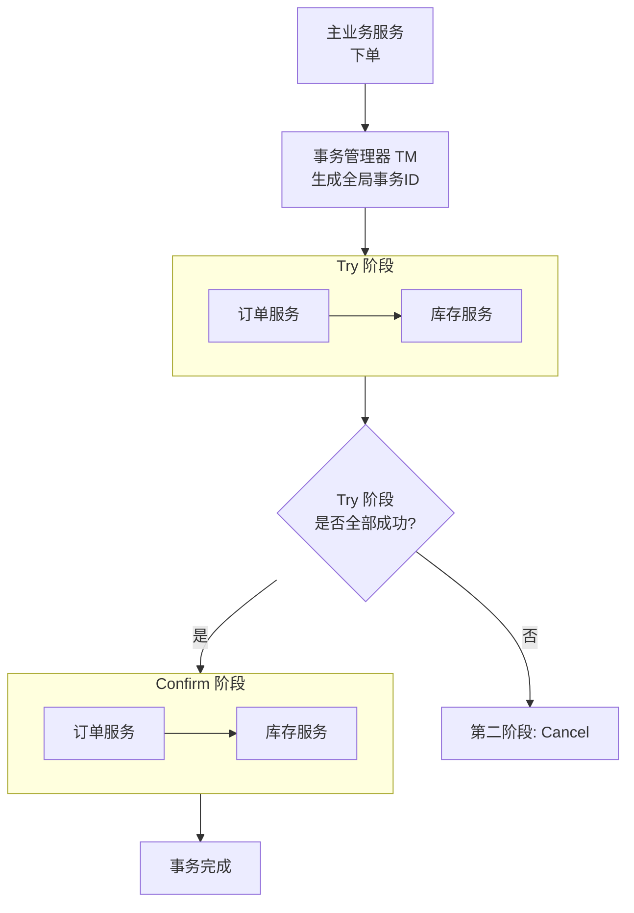
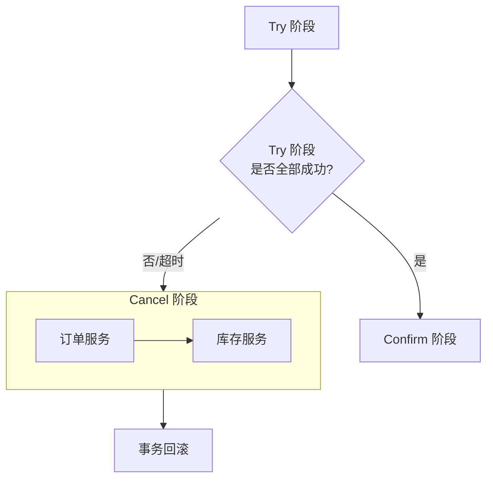

好的，我们来详细拆解TCC（Try-Confirm-Cancel）模式的整个流程。这是一个**业务层面**的两阶段提交协议，用于保证分布式系统中多个服务操作的最终一致性。

---

### 核心概念

TCC将业务操作分为三个逻辑阶段：

1.  **Try（尝试）**：预留必要的业务资源，完成所有业务的检查和约束，为后续的确认做准备。
2.  **Confirm（确认）**：真正执行业务操作，使用Try阶段预留的资源。要求幂等。
3.  **Cancel（取消）**：释放Try阶段预留的资源。要求幂等。

整个流程由一个**事务管理器**（TM）来协调。

---

### 角色定义

- **主业务服务**：整个分布式事务的发起者。
- **从业务服务**：参与分布式事务的各个微服务，提供TCC接口。
- **事务管理器**：协调者，记录事务状态，负责调用Confirm或Cancel。可以是独立的组件，也可以由主业务服务充当。

---

### 正常成功流程

我们用一个经典的例子来说明：**用户下单扣库存**。
涉及两个服务：`订单服务` 和 `库存服务`。

**具体步骤：**

1.  **Try 阶段（资源检查与预留）**
    - 主业务服务（下单）向事务管理器（TM）发起全局事务，生成一个全局事务ID。
    - TM调用所有参与者的Try接口：
        - **订单服务.try()**：创建一个订单，但状态不是“已确认”，而是“待确认”。这防止了脏数据被外部看到。
        - **库存服务.try()**：不是直接扣减库存，而是**冻结**对应商品的数量（例如，冻结1件库存）。`可用库存 = 总库存 - 冻结库存`。
    - 如果所有参与者的Try接口都执行成功，TM记录事务状态为“Try成功”，进入Confirm阶段。

2.  **Confirm 阶段（业务确认）**
    - TM调用所有参与者的Confirm接口。Confirm操作必须是**幂等**的。
        - **订单服务.confirm()**：将订单状态从“待确认”更新为“已确认”。
        - **库存服务.confirm()**：将Try阶段冻结的库存**真正扣减**。`总库存 = 总库存 - 冻结数量`，同时`冻结数量 = 0`。
    - 如果所有Confirm都成功，TM记录事务状态为“已完成”，整个事务成功结束。

---

### 异常失败流程

如果在Try阶段有任何参与者失败（例如库存不足、服务网络超时），则进入Cancel阶段。

**具体步骤：**

1.  **Try 阶段失败**
    - 假设库存服务Try失败（返回“库存不足”）。
    - TM捕获到失败，记录事务状态为“Try失败”，然后调用所有**已执行Try成功**的参与者的Cancel接口。

2.  **Cancel 阶段（资源释放）**
    - TM调用参与者的Cancel接口。Cancel操作也必须是**幂等**的。
        - **订单服务.cancel()**：删除（或标记为“已取消”）在Try阶段创建的“待确认”订单。
        - **库存服务.cancel()**：释放Try阶段冻结的库存。`冻结数量 = 冻结数量 - 1`。
    - 所有资源回滚到事务开始前的状态，事务结束。

---

### 网络异常等特殊情况的处理（TCC的难点）

这是TCC实现中最复杂的地方，主要靠**事务日志**和**重试机制**来保证。

**1. 空回滚**
- **场景**：Try请求没到库存服务，但TM收到了网络超时，误以为Try失败，发起了Cancel请求。
- **结果**：一个根本没执行Try的服务，收到了Cancel指令。
- **解决方案**：在Cancel接口中，先检查是否存在对应的Try记录。如果不存在，需要记录一条“空回滚”日志，然后直接返回成功，避免误释放资源。

**2. 防悬挂**
- **场景**：空回滚发生后，那个被网络延迟的Try请求终于到达了库存服务并执行成功。
- **结果**：Try在Cancel之后执行，导致资源被永久冻结（因为Cancel已经执行过，不会再执行了）。
- **解决方案**：在Try接口中，先检查是否存在对应的“空回滚”记录。如果存在，则拒绝执行Try，防止资源悬挂。

**3. 幂等性**
- **场景**：TM调用Confirm接口时网络超时，TM不确定是否成功，于是发起重试。
- **结果**：同一个Confirm请求可能被调用多次。
- **解决方案**：每个服务在处理Confirm/Cancel时，必须先根据全局事务ID查询本地事务状态。如果已经处理过，则直接返回成功，不再执行业务逻辑。

---

### 核心要点总结

| 阶段 | 核心动作 | 要求 | 类比 |
| :--- | :--- | :--- | :--- |
| **Try** | **检查与预留** | 业务检查，预留资源（冻结、创建中间状态） | 网购时**下单**，锁定库存，但未付款。 |
| **Confirm** | **最终确认** | **幂等性**，使用预留的资源完成业务 | **支付成功**，库存正式扣减，订单生效。 |
| **Cancel** | **释放资源** | **幂等性**，释放Try阶段预留的资源 | **取消订单**，释放锁定的库存。 |

**TCC的优势：**
- **最终一致性**：在分布式系统中实现数据一致。
- **高性能**：资源锁定时间短（仅在Try到Confirm之间），并发性高。
- **灵活性**：业务自定义，不依赖于数据库的XA协议。

**TGC的劣势：**
- **代码侵入性强**：需要为每个业务操作设计Try/Confirm/Cancel三个接口。
- **开发复杂度高**：需要处理空回滚、防悬挂、幂等性等复杂问题。
- **业务模型要求高**：不是所有业务都能很容易地拆分成“预留/确认”两个步骤。

**适用场景**：对一致性要求高、执行时间短、涉及多个服务的业务，如金融交易、账户扣款、库存扣减等。